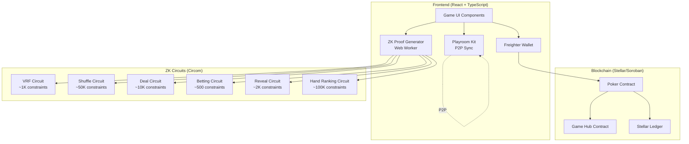
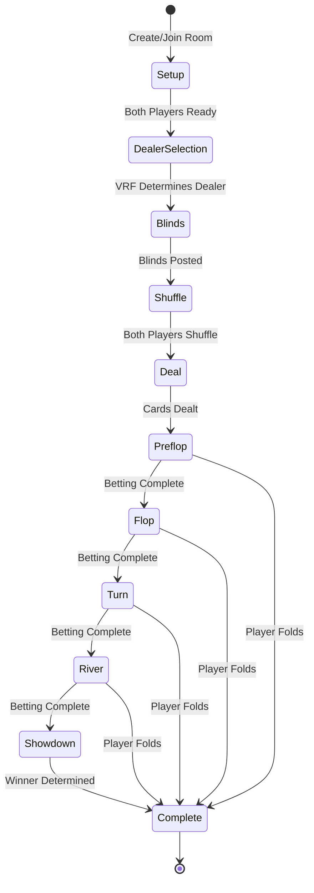

# ZK Poker Production - Design Document

## 1. Overview

### 1.1 Purpose

This design document specifies the architecture and implementation details for a production-grade Texas Hold'em poker game on Stellar blockchain with zero-knowledge proofs. The system enables two players to play complete poker hands with provable fairness, privacy-preserving gameplay, and verifiable statistics.

### 1.2 Design Goals

- **Protocol 25 (X-Ray) Integration**: Leverage Stellar's new BN254 elliptic-curve operations and Poseidon hash functions for on-chain ZK proof verification
- **Complete Poker Mechanics**: Full Texas Hold'em with preflop, flop, turn, river, and showdown phases
- **Provable Fairness**: Every game action (shuffle, deal, bet, reveal) backed by ZK proofs verified on-chain
- **Privacy Preservation**: Hole cards remain private until showdown, betting amounts encrypted
- **Verifiable Statistics**: On-chain player stats that are cryptographically verifiable
- **Simple UX**: Community cards displayed side-by-side, clear game state, no complex animations
- **Performance**: Proof generation < 10s, transaction confirmation < 5s

### 1.3 Protocol 25 (X-Ray) Advantages

Stellar's Protocol 25 introduces protocol-level cryptographic primitives that make ZK poker realistic:

- **BN254 Elliptic Curve Operations**: Native support for Groth16 proof verification on-chain
- **Poseidon Hash Functions**: ZK-friendly hashing for commitments (more efficient than SHA-256 in circuits)
- **On-Chain Verification**: No need for off-chain verifiers or oracles - proofs verified directly in Soroban contracts
- **Fair by Design**: Cryptographic guarantees of fairness built into the protocol layer

This enables "fair by design" game mechanics where players can verify fairness without trusting the game operator.

### 1.3 Current State Analysis

**Existing Implementation:**
- Basic commit/reveal game flow with Poseidon commitments
- Simple hand ranking circuit (~50K constraints) that only checks flush
- Contract methods: `start_game`, `submit_commitment`, `reveal_winner`
- Frontend: GameScreen with poker table UI, card display, basic controls
- Game Hub integration for points management

**Missing Components:**
- Multi-round betting system (preflop, flop, turn, river)
- Community card progressive reveal mechanism
- 5 additional ZK circuits (VRF, shuffle, deal, betting, reveal)
- Enhanced hand ranking circuit (all 10 poker hands)
- Player statistics storage and verification
- Pot claiming workflow
- Betting history and UI enhancements


## 2. Architecture

### 2.1 System Architecture



### 2.2 Game Flow Architecture



### 2.3 Component Architecture

**Contract Layer (Soroban Rust)**
- `PockerContract`: Main game contract following Game Hub pattern
- `GameState`: Multi-round state machine (Preflop → Flop → Turn → River → Showdown)
- `PlayerStats`: On-chain statistics storage
- `Verifier`: Groth16 proof verification using Protocol 25

**Circuit Layer (Circom)**
- 6 independent circuits for different game phases
- Shared utilities for card validation and Poseidon hashing
- Optimized constraint counts for fast proof generation

**Frontend Layer (React + TypeScript)**
- `GameEngine`: Core game logic and state management
- `ZKService`: Proof generation orchestration with Web Workers
- `PockerService`: Contract interaction and transaction building
- `PlayroomSync`: Real-time P2P state synchronization
- UI Components: Table, cards, betting controls, statistics


## 3. Components and Interfaces

### 3.1 Smart Contract (Soroban)

#### 3.1.1 Enhanced Game State

```rust
#[contracttype]
pub struct GameState {
    // Players
    pub player1: Address,
    pub player2: Address,
    pub dealer_button: u8,  // 0 = player1, 1 = player2
    
    // Points (from Game Hub)
    pub player1_points: i128,
    pub player2_points: i128,
    
    // Stacks (remaining chips)
    pub player1_stack: i128,
    pub player2_stack: i128,
    
    // Current bets in this round
    pub player1_bet: i128,
    pub player2_bet: i128,
    
    // Pot
    pub pot: i128,
    
    // Game phase
    pub phase: GamePhase,
    
    // Cards
    pub community_cards: Vec<u8>,  // Revealed community cards (0-5)
    pub deck_commitment: BytesN<32>,  // Commitment to shuffled deck
    
    // Commitments
    pub player1_hole_commitment: Option<BytesN<32>>,
    pub player2_hole_commitment: Option<BytesN<32>>,
    
    // Turn tracking
    pub current_actor: u8,  // 0 = player1, 1 = player2
    pub last_action: Action,
    pub last_raise_amount: i128,
    
    // Showdown
    pub winner: Option<Address>,
}

#[contracttype]
pub enum GamePhase {
    Setup,       // Waiting for dealer selection
    Blinds,      // Posting blinds
    Shuffle,     // Multi-party shuffle
    Deal,        // Dealing hole cards
    Preflop,     // First betting round
    Flop,        // 3 community cards + betting
    Turn,        // 4th community card + betting
    River,       // 5th community card + betting
    Showdown,    // Reveal and determine winner
    Complete,    // Game finished
}

#[contracttype]
pub enum Action {
    None,
    Fold,
    Check,
    Call,
    Bet(i128),
    Raise(i128),
    AllIn,
}

#[contracttype]
pub struct PlayerStats {
    pub games_played: u32,
    pub games_won: u32,
    pub total_winnings: i128,
    pub biggest_pot: i128,
    pub current_streak: i32,  // Positive = win streak, negative = loss streak
}
```

#### 3.1.2 Contract Methods

**Game Lifecycle:**
```rust
// Initialize game with VRF-determined dealer
fn start_game(
    env: Env,
    session_id: u32,
    player1: Address,
    player2: Address,
    player1_points: i128,
    player2_points: i128,
    dealer_button: u8,
    vrf_proof: Groth16Proof,
    vrf_public_signals: Vec<Bytes>,
) -> Result<(), Error>

// Post blinds (automatic based on dealer position)
fn post_blinds(
    env: Env,
    session_id: u32,
    player: Address,
) -> Result<(), Error>

// Submit shuffle proof (multi-party computation)
fn commit_shuffle(
    env: Env,
    session_id: u32,
    player: Address,
    shuffle_proof: Groth16Proof,
    shuffle_public_signals: Vec<Bytes>,
) -> Result<(), Error>

// Deal cards with proof
fn deal_cards(
    env: Env,
    session_id: u32,
    deal_proof: Groth16Proof,
    deal_public_signals: Vec<Bytes>,
) -> Result<(), Error>
```

**Betting Actions:**
```rust
// Execute player action with optional ZK proof
fn player_action(
    env: Env,
    session_id: u32,
    player: Address,
    action: Action,
    bet_proof: Option<Groth16Proof>,
    bet_public_signals: Option<Vec<Bytes>>,
) -> Result<(), Error>
```

**Community Card Reveals:**
```rust
// Reveal community cards for current phase
fn reveal_community(
    env: Env,
    session_id: u32,
    phase: GamePhase,
    reveal_proof: Groth16Proof,
    reveal_public_signals: Vec<Bytes>,
) -> Result<(), Error>
```

**Showdown:**
```rust
// Reveal winner with hand ranking proof
fn reveal_winner(
    env: Env,
    session_id: u32,
    hand_proof: Groth16Proof,
    hand_public_signals: Vec<Bytes>,
) -> Result<Address, Error>

// Claim pot (winner only)
fn claim_pot(
    env: Env,
    session_id: u32,
    player: Address,
) -> Result<i128, Error>
```

**Statistics:**
```rust
// Get player statistics
fn get_stats(
    env: Env,
    player: Address,
) -> Result<PlayerStats, Error>

// Update statistics (internal, called by end_game)
fn update_stats(
    env: &Env,
    player: &Address,
    won: bool,
    pot_amount: i128,
) -> Result<(), Error>
```

**Query Methods:**
```rust
fn get_game(env: Env, session_id: u32) -> Result<GameState, Error>
fn get_current_actor(env: Env, session_id: u32) -> Result<Address, Error>
fn get_pot(env: Env, session_id: u32) -> Result<i128, Error>
```


### 3.2 ZK Circuits (Circom)

#### 3.2.1 VRF Circuit (Dealer Selection)

**Purpose:** Provably fair dealer button assignment using verifiable random function

**Circuit: `prove_random_roll.circom`**
```circom
template VRFDealerSelection() {
    signal input player1_seed;
    signal input player2_seed;
    
    signal output random_number;  // 0 or 1
    signal output dealer_button;  // 0 = player1, 1 = player2
    
    // Combine seeds using Poseidon hash
    component hasher = Poseidon(2);
    hasher.inputs[0] <== player1_seed;
    hasher.inputs[1] <== player2_seed;
    
    // Extract random bit (LSB of hash)
    signal hash_output;
    hash_output <== hasher.out;
    
    // Modulo 2 to get 0 or 1
    dealer_button <-- hash_output % 2;
    signal check;
    check <== dealer_button * 2;
    check === hash_output - (hash_output - dealer_button * 2);
    
    random_number <== dealer_button;
}
```

**Constraints:** ~1,000  
**Public Inputs:** None (seeds are private)  
**Public Outputs:** `dealer_button` (0 or 1)

#### 3.2.2 Deck Shuffle Circuit

**Purpose:** Verify valid deck shuffle without revealing permutation

**Circuit: `prove_shuffle.circom`**
```circom
template DeckShuffle() {
    signal input original_deck[52];
    signal input permutation[52];
    signal input player_id;
    signal input shuffle_salt;
    
    signal output shuffled_deck[52];
    signal output commitment;
    
    // Apply permutation
    for (var i = 0; i < 52; i++) {
        shuffled_deck[i] <== original_deck[permutation[i]];
    }
    
    // Verify permutation is valid (all indices 0-51 used exactly once)
    component uniqueness[52];
    for (var i = 0; i < 52; i++) {
        uniqueness[i] = IsInRange(0, 51);
        uniqueness[i].in <== permutation[i];
    }
    
    // Check no duplicates using pairwise comparisons
    component notEqual[52*51/2];
    var idx = 0;
    for (var i = 0; i < 52; i++) {
        for (var j = i+1; j < 52; j++) {
            notEqual[idx] = IsEqual();
            notEqual[idx].in[0] <== permutation[i];
            notEqual[idx].in[1] <== permutation[j];
            notEqual[idx].out === 0;  // Must not be equal
            idx++;
        }
    }
    
    // Commit to shuffled deck
    component hasher = Poseidon(54);
    for (var i = 0; i < 52; i++) {
        hasher.inputs[i] <== shuffled_deck[i];
    }
    hasher.inputs[52] <== player_id;
    hasher.inputs[53] <== shuffle_salt;
    commitment <== hasher.out;
}
```

**Constraints:** ~50,000  
**Public Inputs:** `original_deck` (or commitment to it)  
**Public Outputs:** `shuffled_deck` commitment

#### 3.2.3 Card Deal Circuit

**Purpose:** Prove cards dealt from top of shuffled deck

**Circuit: `prove_deal.circom`**
```circom
template CardDeal() {
    signal input shuffled_deck[52];
    signal input deal_positions[9];  // 2 hole cards per player + 5 community
    
    signal output dealt_cards[9];
    signal output remaining_deck[43];
    
    // Extract cards at specified positions
    for (var i = 0; i < 9; i++) {
        dealt_cards[i] <== shuffled_deck[deal_positions[i]];
    }
    
    // Verify deal positions are sequential from top
    // Positions should be: 0, 1, 2, 3, 4, 5, 6, 7, 8
    for (var i = 0; i < 9; i++) {
        deal_positions[i] === i;
    }
    
    // Remaining deck
    for (var i = 0; i < 43; i++) {
        remaining_deck[i] <== shuffled_deck[i + 9];
    }
}
```

**Constraints:** ~10,000  
**Public Inputs:** `shuffled_deck` commitment  
**Public Outputs:** `dealt_cards` commitments

#### 3.2.4 Betting Validation Circuit

**Purpose:** Validate betting action meets game rules

**Circuit: `prove_bet.circom`**
```circom
template BettingValidation() {
    signal input bet_amount;
    signal input player_stack;
    signal input min_bet;
    signal input current_bet;
    signal input action_type;  // 0=fold, 1=check, 2=call, 3=bet, 4=raise, 5=allin
    
    signal output valid;
    
    // Check player has sufficient funds
    component hasEnough = GreaterEqThan(32);
    hasEnough.in[0] <== player_stack;
    hasEnough.in[1] <== bet_amount;
    
    // Check bet meets minimum
    component meetsMin = GreaterEqThan(32);
    meetsMin.in[0] <== bet_amount;
    meetsMin.in[1] <== min_bet;
    
    // Check raise is at least 2x current bet
    component validRaise = GreaterEqThan(32);
    validRaise.in[0] <== bet_amount;
    validRaise.in[1] <== current_bet * 2;
    
    // Validate based on action type
    signal checks[5];
    checks[0] <== 1;  // Fold always valid
    checks[1] <== (current_bet === 0) ? 1 : 0;  // Check only if no bet
    checks[2] <== (bet_amount === current_bet) ? 1 : 0;  // Call matches bet
    checks[3] <== meetsMin.out;  // Bet meets minimum
    checks[4] <== validRaise.out;  // Raise is 2x+
    
    valid <== checks[action_type] * hasEnough.out;
}
```

**Constraints:** ~500  
**Public Inputs:** `min_bet`, `current_bet`  
**Public Outputs:** `valid` (0 or 1)

#### 3.2.5 Community Card Reveal Circuit

**Purpose:** Prove revealed card matches pre-deal commitment

**Circuit: `prove_reveal.circom`**
```circom
template CommunityReveal() {
    signal input deck_commitment;
    signal input card_index;  // Which card to reveal (0-4 for community)
    signal input card_value;
    signal input decryption_key;
    signal input salt;
    
    signal output revealed_card;
    
    // Verify card matches commitment
    component hasher = Poseidon(4);
    hasher.inputs[0] <== card_value;
    hasher.inputs[1] <== card_index;
    hasher.inputs[2] <== decryption_key;
    hasher.inputs[3] <== salt;
    
    hasher.out === deck_commitment;
    
    revealed_card <== card_value;
}
```

**Constraints:** ~2,000  
**Public Inputs:** `deck_commitment`, `card_index`  
**Public Outputs:** `revealed_card`


#### 3.2.6 Enhanced Hand Ranking Circuit

**Purpose:** Evaluate poker hands and determine winner

**Circuit: `poker_game.circom` (Enhanced)**
```circom
template HandRanking() {
    signal input player1_hole[2];
    signal input player2_hole[2];
    signal input community[5];
    signal input player1_salt;
    signal input player2_salt;
    
    signal input player1_commitment;
    signal input player2_commitment;
    
    signal output player1_ranking;  // 0-9 (high card to royal flush)
    signal output player2_ranking;
    signal output winner;  // 1 = player1, 2 = player2, 0 = tie
    
    // Verify commitments
    component p1Hasher = Poseidon(3);
    p1Hasher.inputs[0] <== player1_hole[0];
    p1Hasher.inputs[1] <== player1_hole[1];
    p1Hasher.inputs[2] <== player1_salt;
    p1Hasher.out === player1_commitment;
    
    component p2Hasher = Poseidon(3);
    p2Hasher.inputs[0] <== player2_hole[0];
    p2Hasher.inputs[1] <== player2_hole[1];
    p2Hasher.inputs[2] <== player2_salt;
    p2Hasher.out === player2_commitment;
    
    // Combine hole cards with community cards
    signal player1_cards[7];
    signal player2_cards[7];
    
    player1_cards[0] <== player1_hole[0];
    player1_cards[1] <== player1_hole[1];
    player2_cards[0] <== player2_hole[0];
    player2_cards[1] <== player2_hole[1];
    
    for (var i = 0; i < 5; i++) {
        player1_cards[i+2] <== community[i];
        player2_cards[i+2] <== community[i];
    }
    
    // Evaluate best 5-card hand for each player
    component p1Eval = EvaluateHand();
    for (var i = 0; i < 7; i++) {
        p1Eval.cards[i] <== player1_cards[i];
    }
    player1_ranking <== p1Eval.ranking;
    
    component p2Eval = EvaluateHand();
    for (var i = 0; i < 7; i++) {
        p2Eval.cards[i] <== player2_cards[i];
    }
    player2_ranking <== p2Eval.ranking;
    
    // Determine winner
    component compare = CompareHands();
    compare.ranking1 <== player1_ranking;
    compare.ranking2 <== player2_ranking;
    compare.kickers1 <== p1Eval.kickers;
    compare.kickers2 <== p2Eval.kickers;
    winner <== compare.winner;
}

template EvaluateHand() {
    signal input cards[7];
    signal output ranking;  // 0-9
    signal output kickers[5];  // For tie-breaking
    
    // Extract ranks and suits
    signal ranks[7];
    signal suits[7];
    for (var i = 0; i < 7; i++) {
        ranks[i] <-- cards[i] % 13;
        suits[i] <-- cards[i] \ 13;
    }
    
    // Check for each hand type (highest to lowest)
    component royalFlush = CheckRoyalFlush();
    component straightFlush = CheckStraightFlush();
    component fourOfKind = CheckFourOfKind();
    component fullHouse = CheckFullHouse();
    component flush = CheckFlush();
    component straight = CheckStraight();
    component threeOfKind = CheckThreeOfKind();
    component twoPair = CheckTwoPair();
    component onePair = CheckOnePair();
    
    // Pass ranks and suits to each checker
    for (var i = 0; i < 7; i++) {
        royalFlush.ranks[i] <== ranks[i];
        royalFlush.suits[i] <== suits[i];
        // ... (repeat for all checkers)
    }
    
    // Determine ranking (9 = royal flush, 0 = high card)
    ranking <== royalFlush.found * 9 +
                straightFlush.found * 8 +
                fourOfKind.found * 7 +
                fullHouse.found * 6 +
                flush.found * 5 +
                straight.found * 4 +
                threeOfKind.found * 3 +
                twoPair.found * 2 +
                onePair.found * 1;
    
    // Extract kickers for tie-breaking
    // (Implementation depends on hand type)
}
```

**Constraints:** ~100,000  
**Public Inputs:** `player1_commitment`, `player2_commitment`, `community`  
**Public Outputs:** `player1_ranking`, `player2_ranking`, `winner`

**Hand Rankings:**
- 9: Royal Flush (A-K-Q-J-10 suited)
- 8: Straight Flush (5 consecutive suited)
- 7: Four of a Kind
- 6: Full House (3 of kind + pair)
- 5: Flush (5 suited)
- 4: Straight (5 consecutive)
- 3: Three of a Kind
- 2: Two Pair
- 1: One Pair
- 0: High Card


### 3.3 Frontend Architecture

#### 3.3.1 State Management

**GameContext (React Context)**
```typescript
interface GameState {
  sessionId: number | null;
  phase: GamePhase;
  players: {
    player1: PlayerState;
    player2: PlayerState;
  };
  pot: number;
  communityCards: Card[];  // Display side-by-side, simple layout
  currentActor: 'player1' | 'player2';
  dealerButton: 'player1' | 'player2';
  bettingHistory: BettingAction[];
  myHoleCards: Card[];
  opponentHoleCards: Card[];  // Hidden until showdown
}

interface PlayerState {
  address: string;
  stack: number;
  currentBet: number;
  lastAction: Action;
  stats: PlayerStats;
  isDealer: boolean;
  isActive: boolean;
}

interface BettingAction {
  player: string;
  action: Action;
  amount: number;
  timestamp: number;
}
```

**Community Cards Display:**
- Simple side-by-side layout (no fancy animations)
- 5 card slots in a row
- Cards revealed progressively (3 for flop, then 1 for turn, then 1 for river)
- Use existing card components from `pocker/src/components/`

**State Transitions:**
```typescript
type GamePhase = 
  | 'setup'
  | 'dealer_selection'
  | 'blinds'
  | 'shuffle'
  | 'deal'
  | 'preflop'
  | 'flop'
  | 'turn'
  | 'river'
  | 'showdown'
  | 'complete';

const phaseTransitions: Record<GamePhase, GamePhase[]> = {
  setup: ['dealer_selection'],
  dealer_selection: ['blinds'],
  blinds: ['shuffle'],
  shuffle: ['deal'],
  deal: ['preflop'],
  preflop: ['flop', 'complete'],  // complete if fold
  flop: ['turn', 'complete'],
  turn: ['river', 'complete'],
  river: ['showdown', 'complete'],
  showdown: ['complete'],
  complete: [],
};
```

#### 3.3.2 ZK Service

**ZKService Interface:**
```typescript
class ZKService {
  private worker: Worker;
  
  // Generate VRF proof for dealer selection
  async generateVRFProof(
    player1Seed: bigint,
    player2Seed: bigint
  ): Promise<{
    proof: Groth16Proof;
    publicSignals: string[];
  }>;
  
  // Generate shuffle proof
  async generateShuffleProof(
    originalDeck: number[],
    permutation: number[],
    playerId: number,
    salt: bigint
  ): Promise<{
    proof: Groth16Proof;
    publicSignals: string[];
  }>;
  
  // Generate deal proof
  async generateDealProof(
    shuffledDeck: number[],
    dealPositions: number[]
  ): Promise<{
    proof: Groth16Proof;
    publicSignals: string[];
  }>;
  
  // Generate betting validation proof
  async generateBetProof(
    betAmount: number,
    playerStack: number,
    minBet: number,
    currentBet: number,
    actionType: number
  ): Promise<{
    proof: Groth16Proof;
    publicSignals: string[];
  }>;
  
  // Generate community card reveal proof
  async generateRevealProof(
    deckCommitment: string,
    cardIndex: number,
    cardValue: number,
    decryptionKey: bigint,
    salt: bigint
  ): Promise<{
    proof: Groth16Proof;
    publicSignals: string[];
  }>;
  
  // Generate hand ranking proof
  async generateHandRankingProof(
    player1Hole: number[],
    player2Hole: number[],
    community: number[],
    player1Salt: bigint,
    player2Salt: bigint,
    player1Commitment: string,
    player2Commitment: string
  ): Promise<{
    proof: Groth16Proof;
    publicSignals: string[];
  }>;
}
```

**Web Worker Implementation:**
```typescript
// zkWorker.ts
import { groth16 } from 'snarkjs';

self.onmessage = async (e) => {
  const { type, data } = e.data;
  
  try {
    let result;
    switch (type) {
      case 'vrf':
        result = await generateVRFProof(data);
        break;
      case 'shuffle':
        result = await generateShuffleProof(data);
        break;
      case 'deal':
        result = await generateDealProof(data);
        break;
      case 'bet':
        result = await generateBetProof(data);
        break;
      case 'reveal':
        result = await generateRevealProof(data);
        break;
      case 'ranking':
        result = await generateHandRankingProof(data);
        break;
    }
    
    self.postMessage({ success: true, result });
  } catch (error) {
    self.postMessage({ success: false, error: error.message });
  }
};

async function generateVRFProof(data: any) {
  const { player1Seed, player2Seed } = data;
  
  const input = {
    player1_seed: player1Seed,
    player2_seed: player2Seed,
  };
  
  const { proof, publicSignals } = await groth16.fullProve(
    input,
    '/circuits/vrf.wasm',
    '/circuits/vrf_final.zkey'
  );
  
  return { proof, publicSignals };
}
```

#### 3.3.3 Poker Service

**PockerService Interface:**
```typescript
class PockerService {
  private contract: Contract;
  private wallet: WalletService;
  
  // Start game with VRF proof
  async startGame(
    sessionId: number,
    player1: string,
    player2: string,
    buyIn: number,
    dealerButton: number,
    vrfProof: Groth16Proof,
    vrfPublicSignals: string[]
  ): Promise<TransactionResult>;
  
  // Post blinds
  async postBlinds(
    sessionId: number,
    player: string
  ): Promise<TransactionResult>;
  
  // Submit shuffle
  async commitShuffle(
    sessionId: number,
    player: string,
    shuffleProof: Groth16Proof,
    shufflePublicSignals: string[]
  ): Promise<TransactionResult>;
  
  // Deal cards
  async dealCards(
    sessionId: number,
    dealProof: Groth16Proof,
    dealPublicSignals: string[]
  ): Promise<TransactionResult>;
  
  // Execute betting action
  async playerAction(
    sessionId: number,
    player: string,
    action: Action,
    betProof?: Groth16Proof,
    betPublicSignals?: string[]
  ): Promise<TransactionResult>;
  
  // Reveal community cards
  async revealCommunity(
    sessionId: number,
    phase: GamePhase,
    revealProof: Groth16Proof,
    revealPublicSignals: string[]
  ): Promise<TransactionResult>;
  
  // Reveal winner
  async revealWinner(
    sessionId: number,
    handProof: Groth16Proof,
    handPublicSignals: string[]
  ): Promise<TransactionResult>;
  
  // Claim pot
  async claimPot(
    sessionId: number,
    player: string
  ): Promise<TransactionResult>;
  
  // Get game state
  async getGame(sessionId: number): Promise<GameState>;
  
  // Get player stats
  async getStats(player: string): Promise<PlayerStats>;
}
```

#### 3.3.4 Playroom Integration

**Real-time State Sync:**
```typescript
import { myPlayer, getState, setState, onPlayerJoin } from 'playroomkit';

class PlayroomSync {
  // Broadcast action to opponent
  broadcastAction(action: BettingAction) {
    setState('lastAction', action);
  }
  
  // Listen for opponent actions
  onOpponentAction(callback: (action: BettingAction) => void) {
    onPlayerJoin((player) => {
      player.onQuit(() => {
        // Handle disconnect
      });
    });
    
    // Subscribe to state changes
    getState('lastAction', (action) => {
      if (action.player !== myPlayer().id) {
        callback(action);
      }
    });
  }
  
  // Share decryption keys at showdown
  shareDecryptionKey(key: string) {
    setState(`decryptionKey_${myPlayer().id}`, key);
  }
  
  // Wait for opponent's decryption key
  async waitForOpponentKey(): Promise<string> {
    return new Promise((resolve) => {
      const opponentId = getOpponentId();
      getState(`decryptionKey_${opponentId}`, (key) => {
        if (key) resolve(key);
      });
    });
  }
}
```


## 4. Data Models

### 4.1 Card Representation

**Card Encoding:**
```
Card value = suit * 13 + rank
- Suits: 0 = Clubs, 1 = Diamonds, 2 = Hearts, 3 = Spades
- Ranks: 0 = 2, 1 = 3, ..., 8 = 10, 9 = Jack, 10 = Queen, 11 = King, 12 = Ace

Examples:
- 2 of Clubs = 0 * 13 + 0 = 0
- Ace of Spades = 3 * 13 + 12 = 51
- King of Hearts = 2 * 13 + 11 = 37
```

**Deck Structure:**
```typescript
type Card = number;  // 0-51
type Deck = Card[];  // Array of 52 cards

const SUITS = ['♣', '♦', '♥', '♠'];
const RANKS = ['2', '3', '4', '5', '6', '7', '8', '9', '10', 'J', 'Q', 'K', 'A'];

function cardToString(card: Card): string {
  const suit = Math.floor(card / 13);
  const rank = card % 13;
  return RANKS[rank] + SUITS[suit];
}

function createDeck(): Deck {
  return Array.from({ length: 52 }, (_, i) => i);
}
```

### 4.2 Commitment Scheme

**Poseidon Hash Commitments:**
```typescript
// Commit to hole cards
function commitHoleCards(
  card1: number,
  card2: number,
  salt: bigint
): string {
  return poseidon([card1, card2, salt]);
}

// Commit to shuffled deck
function commitDeck(
  deck: number[],
  playerId: number,
  salt: bigint
): string {
  return poseidon([...deck, playerId, salt]);
}

// Verify commitment
function verifyCommitment(
  commitment: string,
  values: any[],
  salt: bigint
): boolean {
  const computed = poseidon([...values, salt]);
  return computed === commitment;
}
```

### 4.3 Betting State

**Betting Round State:**
```typescript
interface BettingRound {
  phase: 'preflop' | 'flop' | 'turn' | 'river';
  pot: number;
  player1Bet: number;
  player2Bet: number;
  currentActor: 'player1' | 'player2';
  lastAction: Action;
  lastRaiseAmount: number;
  isComplete: boolean;
}

// Betting round is complete when:
// 1. Both players have acted
// 2. Both players have equal bets (or one folded)
// 3. No pending actions
function isBettingRoundComplete(round: BettingRound): boolean {
  if (round.lastAction === 'fold') return true;
  if (round.player1Bet === round.player2Bet && round.lastAction !== 'none') {
    return true;
  }
  return false;
}
```

### 4.4 Statistics Storage

**On-Chain Statistics:**
```rust
#[contracttype]
pub struct PlayerStats {
    pub games_played: u32,
    pub games_won: u32,
    pub total_winnings: i128,
    pub biggest_pot: i128,
    pub current_streak: i32,
}

// Storage key
#[contracttype]
pub enum DataKey {
    Stats(Address),  // Per-player statistics
    // ... other keys
}
```

**Statistics Update Logic:**
```rust
fn update_stats(
    env: &Env,
    player: &Address,
    won: bool,
    pot_amount: i128,
) -> Result<(), Error> {
    let key = DataKey::Stats(player.clone());
    
    let mut stats: PlayerStats = env
        .storage()
        .persistent()
        .get(&key)
        .unwrap_or(PlayerStats {
            games_played: 0,
            games_won: 0,
            total_winnings: 0,
            biggest_pot: 0,
            current_streak: 0,
        });
    
    stats.games_played += 1;
    
    if won {
        stats.games_won += 1;
        stats.total_winnings += pot_amount;
        
        if pot_amount > stats.biggest_pot {
            stats.biggest_pot = pot_amount;
        }
        
        if stats.current_streak >= 0 {
            stats.current_streak += 1;
        } else {
            stats.current_streak = 1;
        }
    } else {
        if stats.current_streak <= 0 {
            stats.current_streak -= 1;
        } else {
            stats.current_streak = -1;
        }
    }
    
    env.storage().persistent().set(&key, &stats);
    Ok(())
}
```

### 4.5 Transaction Data Structures

**Groth16 Proof Format:**
```rust
#[contracttype]
pub struct Groth16Proof {
    pub pi_a: BytesN<64>,    // G1 point (2 * 32 bytes)
    pub pi_b: BytesN<128>,   // G2 point (4 * 32 bytes)
    pub pi_c: BytesN<64>,    // G1 point (2 * 32 bytes)
}

// Convert from snarkjs format
fn convertProof(snarkjsProof: any): Groth16Proof {
    return {
        pi_a: encodeG1Point(snarkjsProof.pi_a),
        pi_b: encodeG2Point(snarkjsProof.pi_b),
        pi_c: encodeG1Point(snarkjsProof.pi_c),
    };
}
```

**Public Signals Format:**
```typescript
// VRF public signals
type VRFPublicSignals = [
  string  // dealer_button (0 or 1)
];

// Shuffle public signals
type ShufflePublicSignals = [
  string  // shuffled_deck_commitment
];

// Deal public signals
type DealPublicSignals = [
  string,  // player1_hole_commitment
  string,  // player2_hole_commitment
  string   // community_commitment
];

// Betting public signals
type BetPublicSignals = [
  string  // valid (0 or 1)
];

// Reveal public signals
type RevealPublicSignals = [
  string  // revealed_card (0-51)
];

// Hand ranking public signals
type HandRankingPublicSignals = [
  string,  // player1_commitment
  string,  // player2_commitment
  string,  // player1_ranking (0-9)
  string,  // player2_ranking (0-9)
  string   // winner (1 = player1, 2 = player2, 0 = tie)
];
```


## 5. Correctness Properties

### 5.1 What are Correctness Properties?

A property is a characteristic or behavior that should hold true across all valid executions of a system—essentially, a formal statement about what the system should do. Properties serve as the bridge between human-readable specifications and machine-verifiable correctness guarantees.

In this poker implementation, properties validate that the game mechanics work correctly across all possible game states, card combinations, and player actions. Each property is universally quantified (applies to all valid inputs) and can be tested using property-based testing frameworks.

### 5.2 Game Setup Properties

**Property 1: Room Creation with Valid Buy-in**  
*For any* valid buy-in amount, creating a room should result in a room with that exact buy-in amount stored.  
**Validates: Requirements 1.1**

**Property 2: Unique Room Codes**  
*For any* set of created rooms, all room codes should be unique (no duplicates).  
**Validates: Requirements 1.2**

**Property 3: Dealer Selection Determinism**  
*For any* pair of player seeds, the VRF circuit should produce the same dealer button assignment when given the same seeds.  
**Validates: Requirements 3.3**

**Property 4: Dealer Button Rotation**  
*For any* completed game, starting a new game between the same players should assign the dealer button to the opposite player.  
**Validates: Requirements 3.5**

### 5.3 Blinds and Pot Properties

**Property 5: Small Blind Deduction**  
*For any* game in blinds phase where player is small blind, posting blinds should decrease that player's stack by exactly 0.1 XLM.  
**Validates: Requirements 4.1**

**Property 6: Big Blind Deduction**  
*For any* game in blinds phase where player is big blind, posting blinds should decrease that player's stack by exactly 0.2 XLM.  
**Validates: Requirements 4.2**

**Property 7: Pot Accumulation After Blinds**  
*For any* game after both blinds are posted, the pot should equal exactly 0.3 XLM (sum of small and big blinds).  
**Validates: Requirements 4.4**

**Property 8: Stack Decrease on Betting**  
*For any* valid bet action, the player's stack should decrease by exactly the bet amount.  
**Validates: Requirements 5.4**

**Property 9: Winner Stack Increase**  
*For any* completed game, the winner's stack should increase by exactly the pot amount.  
**Validates: Requirements 5.5, 18.6**

**Property 10: Pot Accumulation Across Rounds**  
*For any* game, the pot at any point should equal the sum of all bets made across all betting rounds.  
**Validates: Requirements 11.2**

**Property 11: Pot Reset After Distribution**  
*For any* game after pot is claimed, the pot should be exactly 0.  
**Validates: Requirements 20.5**


### 5.4 Deck Shuffling and Dealing Properties

**Property 12: Shuffle Permutation Validity**  
*For any* shuffle proof, the shuffled deck should contain all 52 cards exactly once (no duplicates, no missing cards).  
**Validates: Requirements 6.3**

**Property 13: Sequential Shuffle Verification**  
*For any* multi-party shuffle, proofs should be verified in the order they were submitted (player1 then player2).  
**Validates: Requirements 6.4**

**Property 14: Hole Cards Dealing**  
*For any* deal operation, each player should receive exactly 2 hole cards.  
**Validates: Requirements 7.1**

**Property 15: Deal from Shuffled Deck**  
*For any* deal proof, the dealt cards should come from the committed shuffled deck (verified by ZK proof).  
**Validates: Requirements 7.2, 8.3**

**Property 16: Community Cards Commitment**  
*For any* deal operation, all 5 community cards should be committed upfront before any betting begins.  
**Validates: Requirements 8.1**

**Property 17: Community Card Reveal Round-Trip**  
*For any* revealed community card, the card value should match the original commitment made during the deal phase.  
**Validates: Requirements 8.5, 14.3**

### 5.5 Betting Round Properties

**Property 18: Betting Commitment**  
*For any* betting action, the bet amount should be committed before being revealed to the opponent.  
**Validates: Requirements 9.3**

**Property 19: Minimum Bet Validation**  
*For any* bet action, the ZK proof should validate that the bet amount meets the minimum requirement (0.2 XLM).  
**Validates: Requirements 9.4, 13.2**

**Property 20: Pot Update Atomicity**  
*For any* betting action, the pot update should be atomic (either fully applied or not applied at all).  
**Validates: Requirements 9.5, 20.2**

**Property 21: Betting Round Completion**  
*For any* betting round, the round should complete when both players have equal bets or one player has folded.  
**Validates: Requirements 9.6**

**Property 22: Check Validation**  
*For any* check action, it should only be allowed when the current bet in the round is 0.  
**Validates: Requirements 10.3**

**Property 23: Raise Minimum Validation**  
*For any* raise action, the raise amount should be at least 2x the previous bet.  
**Validates: Requirements 10.5**

**Property 24: All-In Validation**  
*For any* all-in action, the bet amount should equal the player's entire remaining stack.  
**Validates: Requirements 11.3**

**Property 25: Betting Proof Inclusion**  
*For any* betting action (except fold/check), a valid ZK proof should be included with the transaction.  
**Validates: Requirements 13.1**

### 5.6 Community Card Reveal Properties

**Property 26: Flop Burn and Reveal**  
*For any* flop reveal, exactly 1 burn card should be consumed and exactly 3 community cards should be revealed.  
**Validates: Requirements 14.1, 14.2**

**Property 27: Turn Burn and Reveal**  
*For any* turn reveal, exactly 1 burn card should be consumed and exactly 1 additional community card should be revealed (total 4 visible).  
**Validates: Requirements 15.1, 15.2**

**Property 28: River Burn and Reveal**  
*For any* river reveal, exactly 1 burn card should be consumed and exactly 1 additional community card should be revealed (total 5 visible).  
**Validates: Requirements 16.1, 16.2**

**Property 29: Complete Community Cards After River**  
*For any* game after river reveal, exactly 5 community cards should be visible.  
**Validates: Requirements 16.4**

### 5.7 Hand Evaluation Properties

**Property 30: Best Hand Selection**  
*For any* 7 cards (2 hole + 5 community), the hand evaluation should select the best possible 5-card poker hand.  
**Validates: Requirements 17.2**

**Property 31: Hand Ranking Correctness**  
*For any* valid poker hand, the hand ranking circuit should correctly identify the hand type (0-9: high card through royal flush).  
**Validates: Requirements 17.4**

**Property 32: Kicker Tie-Breaking**  
*For any* two hands with equal rankings, the winner should be determined by comparing kicker cards in descending order.  
**Validates: Requirements 17.5**

**Property 33: Hand Ranking Proof Structure**  
*For any* showdown, the hand ranking proof should include player1 hand, player2 hand, both rankings, and the winner.  
**Validates: Requirements 18.3**

**Property 34: Proof Verification**  
*For any* valid Groth16 proof, the contract should accept it; for any invalid proof, the contract should reject it.  
**Validates: Requirements 18.4**

**Property 35: Winner Extraction**  
*For any* verified hand ranking proof, the winner should be correctly extracted from the public signals (1 = player1, 2 = player2).  
**Validates: Requirements 18.5**

### 5.8 Game Termination Properties

**Property 36: Win by Fold**  
*For any* game where a player folds, the opponent should immediately win without requiring hand reveal.  
**Validates: Requirements 19.1, 19.2**

**Property 37: Fold Phase Transition**  
*For any* fold action, the game should transition directly to the complete phase, skipping showdown.  
**Validates: Requirements 19.4**

**Property 38: Fold Action Recording**  
*For any* fold action, the action should be recorded in the game state's betting history.  
**Validates: Requirements 19.5**

**Property 39: Showdown Phase Transition**  
*For any* game where both players remain after river betting, the game should transition to showdown phase.  
**Validates: Requirements 12.4**

**Property 40: Balance Update Consistency**  
*For any* pot distribution, the winner's balance should reflect the pot amount immediately after the transfer.  
**Validates: Requirements 20.3**


### 5.9 Statistics Properties

**Property 41: Games Played Increment**  
*For any* completed game, each player's games_played counter should increment by exactly 1.  
**Validates: Requirements 22.1**

**Property 42: Games Won Increment**  
*For any* completed game, the winner's games_won counter should increment by exactly 1.  
**Validates: Requirements 22.2**

**Property 43: Win Rate Calculation**  
*For any* player with statistics, the win rate should equal games_won divided by games_played.  
**Validates: Requirements 22.3**

**Property 44: Total Winnings Accumulation**  
*For any* player who wins a game, their total_winnings should increase by the pot amount.  
**Validates: Requirements 22.4**

**Property 45: Biggest Pot Tracking**  
*For any* player who wins a pot larger than their current biggest_pot, the biggest_pot should be updated to the new pot amount.  
**Validates: Requirements 22.5**

**Property 46: Win Streak Increment**  
*For any* player who wins a game and has a non-negative streak, their current_streak should increment by 1.  
**Validates: Requirements 22.6**

**Property 47: Loss Streak Decrement**  
*For any* player who loses a game and has a non-positive streak, their current_streak should decrement by 1.  
**Validates: Requirements 22.6**

**Property 48: Per-Player Statistics Storage**  
*For any* player address, statistics should be stored independently and not affect other players' statistics.  
**Validates: Requirements 23.1**

**Property 49: Statistics Atomicity**  
*For any* game completion, statistics updates for both players should be atomic (both succeed or both fail).  
**Validates: Requirements 23.2**

**Property 50: Statistics Monotonicity**  
*For any* player, games_played should never decrease (append-only invariant).  
**Validates: Requirements 23.4**

**Property 51: Statistics Query**  
*For any* player address, calling get_stats should return that player's current statistics.  
**Validates: Requirements 24.3**

### 5.10 Disconnection and Timeout Properties

**Property 52: Disconnect Timeout Auto-Fold**  
*For any* player who disconnects for more than 60 seconds during their turn, the system should automatically fold for that player.  
**Validates: Requirements 27.1**

**Property 53: Game State Preservation During Disconnect**  
*For any* player disconnect, the game state should remain unchanged until the timeout expires or the player reconnects.  
**Validates: Requirements 27.2**

**Property 54: Reconnection State Recovery**  
*For any* player who reconnects before timeout, they should see the exact current game state.  
**Validates: Requirements 27.3**

**Property 55: Auto-Fold Winner**  
*For any* auto-fold due to timeout, the opponent should win the pot automatically.  
**Validates: Requirements 27.5**

### 5.11 Game History Properties

**Property 56: Betting History Ordering**  
*For any* game, the betting history should record all actions in chronological order.  
**Validates: Requirements 28.1**

**Property 57: Betting History Reset**  
*For any* new hand, the betting history should be cleared (reset to empty).  
**Validates: Requirements 28.4**

### 5.12 Pot Odds and Equity Properties

**Property 58: Pot Odds Calculation**  
*For any* betting decision, pot odds should be calculated as (amount to call) / (pot + amount to call).  
**Validates: Requirements 30.1**

**Property 59: Hand Equity Calculation**  
*For any* hand with known hole cards and community cards, equity should be estimated based on possible opponent hands.  
**Validates: Requirements 30.2**

**Property 60: Equity Update on Reveal**  
*For any* community card reveal, hand equity should be recalculated with the new information.  
**Validates: Requirements 30.3**

### 5.13 Circuit-Specific Properties

**Property 61: VRF Output Range**  
*For any* valid VRF proof, the output dealer_button should be either 0 or 1 (no other values).  
**Validates: Requirements 3.2**

**Property 62: Shuffle Commitment Binding**  
*For any* shuffle operation, the commitment should uniquely bind to the shuffled deck (no two different decks produce the same commitment).  
**Validates: Requirements 6.2**

**Property 63: Deal Proof Validity**  
*For any* deal proof, the proof should validate that dealt cards come from positions 0-8 of the shuffled deck.  
**Validates: Requirements 7.2**

**Property 64: Betting Circuit Validation**  
*For any* betting action, the circuit should validate that: (1) player has sufficient funds, (2) bet meets minimum, (3) action is legal.  
**Validates: Requirements 13.2**

**Property 65: Reveal Proof Matching**  
*For any* community card reveal, the reveal proof should validate that the revealed card matches the index in the original commitment.  
**Validates: Requirements 14.3, 15.3, 16.3**


## 6. Error Handling

### 6.1 Contract Error Types

```rust
#[contracterror]
#[derive(Copy, Clone, Debug, Eq, PartialEq)]
#[repr(u32)]
pub enum Error {
    // Game state errors
    GameNotFound = 1,
    GameAlreadyExists = 2,
    GameAlreadyEnded = 3,
    NotInPhase = 4,
    
    // Player errors
    NotPlayer = 5,
    NotYourTurn = 6,
    SelfPlay = 7,
    
    // Commitment errors
    AlreadyCommitted = 8,
    NotCommitted = 9,
    InvalidCommitment = 10,
    CommitmentMismatch = 11,
    
    // Betting errors
    InsufficientFunds = 12,
    BetTooLow = 13,
    InvalidAction = 14,
    RaiseTooSmall = 15,
    
    // Proof errors
    InvalidProof = 16,
    ProofVerificationFailed = 17,
    MissingProof = 18,
    
    // Shuffle/Deal errors
    InvalidShuffle = 19,
    InvalidDeal = 20,
    DuplicateCard = 21,
    MissingCard = 22,
    
    // Statistics errors
    StatsNotFound = 23,
    StatsUpdateFailed = 24,
    
    // Authorization errors
    Unauthorized = 25,
    
    // Timeout errors
    ActionTimeout = 26,
}
```

### 6.2 Error Handling Strategies

**Game State Validation:**
- Check game exists before any operation
- Verify current phase matches expected phase
- Validate player is authorized to perform action
- Ensure game hasn't already ended

**Betting Validation:**
- Verify player has sufficient stack for bet
- Check bet meets minimum requirements
- Validate raise is at least 2x previous bet
- Ensure action is legal in current context

**Proof Validation:**
- Verify proof structure is correct
- Validate public signals match expected format
- Check proof verification succeeds
- Ensure commitments match revealed values

**Graceful Degradation:**
- If proof generation fails, allow retry
- If transaction fails, preserve game state
- If player disconnects, implement timeout
- If contract error, provide clear error message

### 6.3 Frontend Error Handling

```typescript
class ErrorHandler {
  // Handle contract errors
  handleContractError(error: Error): UserMessage {
    if (error.message.includes('GameNotFound')) {
      return { type: 'error', message: 'Game session not found. Please create a new game.' };
    }
    if (error.message.includes('NotYourTurn')) {
      return { type: 'warning', message: 'Please wait for your turn.' };
    }
    if (error.message.includes('InsufficientFunds')) {
      return { type: 'error', message: 'Insufficient chips for this bet.' };
    }
    if (error.message.includes('InvalidProof')) {
      return { type: 'error', message: 'Proof verification failed. Please try again.' };
    }
    return { type: 'error', message: 'An unexpected error occurred.' };
  }
  
  // Handle proof generation errors
  handleProofError(error: Error): UserMessage {
    if (error.message.includes('timeout')) {
      return { type: 'error', message: 'Proof generation timed out. Please try again.' };
    }
    if (error.message.includes('memory')) {
      return { type: 'error', message: 'Insufficient memory for proof generation.' };
    }
    return { type: 'error', message: 'Failed to generate proof. Please try again.' };
  }
  
  // Handle network errors
  handleNetworkError(error: Error): UserMessage {
    if (error.message.includes('timeout')) {
      return { type: 'error', message: 'Network timeout. Please check your connection.' };
    }
    if (error.message.includes('disconnected')) {
      return { type: 'warning', message: 'Connection lost. Attempting to reconnect...' };
    }
    return { type: 'error', message: 'Network error. Please try again.' };
  }
}
```

### 6.4 Retry Logic

**Proof Generation Retry:**
- Retry up to 3 times on failure
- Exponential backoff between retries
- Show progress indicator to user
- Allow manual cancellation

**Transaction Retry:**
- Retry failed transactions once
- Check if transaction already succeeded before retry
- Update gas estimate on retry
- Inform user of retry attempts

**State Sync Retry:**
- Retry state synchronization on disconnect
- Implement exponential backoff
- Maximum 5 retry attempts
- Fall back to contract query if P2P fails


## 7. Testing Strategy

### 7.1 Testing Approach

This project uses a dual testing approach combining unit tests and property-based tests:

- **Unit Tests**: Verify specific examples, edge cases, and error conditions
- **Property Tests**: Verify universal properties across all inputs using randomization

Both approaches are complementary and necessary for comprehensive coverage. Unit tests catch concrete bugs in specific scenarios, while property tests verify general correctness across the input space.

### 7.2 Circuit Testing

**Testing Framework:** Circom testing with Mocha/Chai

**VRF Circuit Tests:**
- Unit test: Specific seed pairs produce expected dealer assignments
- Property test: For any two seeds, output is always 0 or 1
- Property test: Same seeds always produce same output (determinism)
- Edge case: Maximum value seeds
- Edge case: Zero seeds

**Shuffle Circuit Tests:**
- Unit test: Valid permutation produces valid shuffle
- Property test: For any valid permutation, all 52 cards present exactly once
- Property test: For any shuffle, no duplicate cards exist
- Edge case: Identity permutation (no shuffle)
- Edge case: Reverse permutation

**Deal Circuit Tests:**
- Unit test: Dealing from specific deck produces expected cards
- Property test: For any shuffled deck, dealt cards come from positions 0-8
- Property test: For any deal, 9 cards are dealt (2+2+5)
- Edge case: Dealing from deck with specific patterns

**Betting Circuit Tests:**
- Unit test: Valid bet with sufficient funds passes
- Property test: For any bet where amount > stack, validation fails
- Property test: For any bet where amount < minimum, validation fails
- Property test: For any raise where amount < 2x current bet, validation fails
- Edge case: All-in bet (amount = stack)
- Edge case: Minimum bet exactly

**Reveal Circuit Tests:**
- Unit test: Revealing specific card matches commitment
- Property test: For any card and commitment, reveal proof validates correctly
- Property test: For any mismatched card and commitment, reveal proof fails
- Edge case: Revealing first card (index 0)
- Edge case: Revealing last card (index 4)

**Hand Ranking Circuit Tests:**
- Unit test: Royal flush correctly identified
- Unit test: Straight flush correctly identified
- Unit test: Four of a kind correctly identified
- Unit test: Full house correctly identified
- Unit test: Flush correctly identified
- Unit test: Straight correctly identified
- Unit test: Three of a kind correctly identified
- Unit test: Two pair correctly identified
- Unit test: One pair correctly identified
- Unit test: High card correctly identified
- Property test: For any 7 cards, ranking is in range 0-9
- Property test: For any two hands with same ranking, kickers determine winner
- Edge case: Wheel straight (A-2-3-4-5)
- Edge case: Ace-high straight (10-J-Q-K-A)
- Edge case: All same suit (flush)

### 7.3 Contract Testing

**Testing Framework:** Soroban SDK test framework with Rust

**Game Initialization Tests:**
- Unit test: Creating game with valid parameters succeeds
- Unit test: Creating game with same player twice fails (self-play)
- Property test: For any valid buy-in amount, game is created with that amount
- Property test: For any game, Game Hub start_game is called
- Edge case: Zero buy-in
- Edge case: Maximum buy-in

**Blinds Tests:**
- Unit test: Small blind posts 0.1 XLM
- Unit test: Big blind posts 0.2 XLM
- Property test: For any game after blinds, pot equals 0.3 XLM
- Property test: For any blind posting, stack decreases by blind amount
- Edge case: Player with insufficient stack for blind

**Betting Round Tests:**
- Unit test: Valid fold action succeeds
- Unit test: Valid check action succeeds (when no bet)
- Unit test: Valid call action succeeds
- Unit test: Valid bet action succeeds
- Unit test: Valid raise action succeeds
- Property test: For any bet, stack decreases by bet amount
- Property test: For any bet, pot increases by bet amount
- Property test: For any betting round, round completes when bets equal
- Edge case: Check when bet exists (should fail)
- Edge case: Raise less than 2x (should fail)
- Edge case: Bet more than stack (should fail)

**Phase Transition Tests:**
- Unit test: Preflop transitions to flop after betting complete
- Unit test: Flop transitions to turn after betting complete
- Unit test: Turn transitions to river after betting complete
- Unit test: River transitions to showdown after betting complete
- Unit test: Any phase transitions to complete on fold
- Property test: For any fold, game transitions to complete
- Property test: For any phase, only valid next phases are reachable

**Pot Distribution Tests:**
- Unit test: Winner receives entire pot
- Property test: For any game completion, winner's stack increases by pot
- Property test: For any pot distribution, pot resets to 0
- Property test: For any pot claim, transfer is atomic
- Edge case: Pot distribution with zero pot

**Statistics Tests:**
- Unit test: First game initializes stats correctly
- Unit test: Winning game increments games_won
- Unit test: Losing game doesn't increment games_won
- Property test: For any completed game, games_played increments by 1
- Property test: For any win, total_winnings increases by pot amount
- Property test: For any win with pot > biggest_pot, biggest_pot updates
- Property test: For any win, streak increments (or resets to 1)
- Property test: For any loss, streak decrements (or resets to -1)
- Edge case: Win rate with 0 games played

**Proof Verification Tests:**
- Unit test: Valid proof is accepted
- Unit test: Invalid proof is rejected
- Unit test: Proof with wrong public signals is rejected
- Property test: For any valid proof, verification succeeds
- Property test: For any invalid proof, verification fails
- Edge case: Proof with corrupted data

### 7.4 Integration Testing

**End-to-End Game Flow:**
- Test complete game from creation to pot distribution
- Test game with fold in preflop
- Test game with fold in flop
- Test game with all-in
- Test game with multiple raises
- Test game with showdown

**Multi-Player Testing:**
- Test two players completing full game
- Test simultaneous actions (race conditions)
- Test action ordering and turn management
- Test state synchronization via Playroom
- Test disconnect and reconnect

**Performance Testing:**
- Measure proof generation times for each circuit
- Measure transaction confirmation times
- Measure UI responsiveness under load
- Measure memory usage during proof generation
- Verify all operations meet performance requirements

### 7.5 Property-Based Testing Configuration

**Framework:** fast-check (TypeScript) for frontend, proptest (Rust) for contract

**Configuration:**
- Minimum 100 iterations per property test
- Seed-based reproducibility for failed tests
- Shrinking enabled to find minimal failing examples
- Timeout: 30 seconds per property test

**Test Tagging:**
Each property test must include a comment referencing the design property:
```typescript
// Feature: zk-poker-production, Property 8: Stack Decrease on Betting
test('player stack decreases by bet amount', async () => {
  await fc.assert(
    fc.asyncProperty(
      fc.integer({ min: 1, max: 1000 }),
      async (betAmount) => {
        // Test implementation
      }
    ),
    { numRuns: 100 }
  );
});
```

### 7.6 Test Coverage Goals

- **Circuit Coverage:** 100% of circuit logic paths
- **Contract Coverage:** 95%+ of contract code
- **Frontend Coverage:** 80%+ of critical paths
- **Property Coverage:** All 65 correctness properties tested
- **Edge Case Coverage:** All identified edge cases tested

### 7.7 Testing Approach

**Focus on Core Functionality:**
- Test circuits compile and generate valid proofs
- Test contract methods work correctly
- Test UI displays game state correctly
- Manual testing of complete game flow

**No CI/CD Required:**
- Run tests manually during development
- Verify circuits work with `npm test` in circuits/pocker directory
- Verify contract works with `cargo test` in contracts/pocker directory
- Verify UI works by playing a complete game

**Success Criteria:**
- All circuit tests pass
- All contract tests pass
- Can complete a full game from start to pot distribution
- Community cards display correctly (side-by-side layout, simple presentation)


## 8. Implementation Notes

### 8.1 Stellar Game Studio Integration

This implementation follows the Stellar Game Studio patterns and leverages Protocol 25 (X-Ray):

**Protocol 25 Integration:**
- Uses BN254 elliptic curve operations for Groth16 proof verification
- Uses Poseidon hash functions for ZK-friendly commitments
- Verifies all ZK proofs on-chain using Protocol 25 primitives
- No off-chain verifiers or oracles needed

**Contract Structure:**
- Implements Game Hub client interface for `start_game` and `end_game`
- Uses `__constructor(env, admin, game_hub)` for initialization
- Stores game state in temporary storage with 30-day TTL
- Extends TTL on every state write
- Uses `Error` enum for all error conditions
- Provides `get_game` for UI state reads

**Deterministic Randomness:**
- VRF circuit uses committed player seeds (no ledger time/sequence)
- Shuffle uses player-provided permutations with ZK validation
- All randomness is deterministic and reproducible

**Testing:**
- Unit tests in `contracts/pocker/src/test.rs`
- Uses mock Game Hub pattern from `contracts/mock-game-hub`
- Tests cover start, play progression, and end-game reporting

**Bindings:**
- Generate bindings after contract changes: `bun run build pocker && bun run bindings pocker`
- Copy generated bindings to `pocker/src/games/pocker/bindings.ts`
- Never edit generated bindings manually

**Frontend:**
- Standalone frontend in `pocker/` directory (existing implementation)
- Build on existing UI components and structure
- Contract ID configured in `pocker/public/game-studio-config.js`
- Run with `bun run dev:game pocker`

### 8.2 Circuit Compilation and Setup

**Prerequisites:**
- Node.js 16+
- Circom 2.1.0+
- snarkjs 0.7.0+
- Powers of Tau ceremony file (ptau)

**Build Process:**
```bash
cd circuits/pocker

# Compile circuits
circom src/vrf.circom --r1cs --wasm --sym -o build/
circom src/shuffle.circom --r1cs --wasm --sym -o build/
circom src/deal.circom --r1cs --wasm --sym -o build/
circom src/bet.circom --r1cs --wasm --sym -o build/
circom src/reveal.circom --r1cs --wasm --sym -o build/
circom src/poker_game.circom --r1cs --wasm --sym -o build/

# Generate proving and verification keys
snarkjs groth16 setup build/vrf.r1cs powersOfTau28_hez_final_14.ptau vrf_0000.zkey
snarkjs zkey contribute vrf_0000.zkey vrf_final.zkey --name="Contribution" -v
snarkjs zkey export verificationkey vrf_final.zkey vrf_vk.json

# Repeat for all circuits
```

**Verification Key Upload:**
```rust
// Upload verification keys to contract
let vrf_vk = load_verification_key("vrf_vk.json");
contract.set_verification_key(vrf_vk);
```

### 8.3 Performance Optimization

**Circuit Optimization:**
- Use lookup tables for repeated operations
- Minimize constraint count in critical paths
- Batch similar operations
- Use efficient hash functions (Poseidon over SHA-256)

**Proof Generation Optimization:**
- Use Web Workers to avoid blocking UI
- Cache witness generation results
- Parallelize independent proof generations
- Show progress indicators for long operations

**Contract Optimization:**
- Minimize storage reads/writes
- Batch related operations
- Use efficient data structures
- Optimize proof verification (use Protocol 25 primitives)

**Frontend Optimization:**
- Lazy load circuit files
- Preload common circuits
- Cache proof generation results
- Use optimistic UI updates

### 8.4 Security Considerations

**Cryptographic Security:**
- Use secure random number generation (crypto.getRandomValues)
- Validate all ZK proofs on-chain
- Ensure commitments are binding and hiding
- Use proper key derivation (PBKDF2 or similar)

**Smart Contract Security:**
- Validate all inputs
- Check authorization for all actions
- Prevent reentrancy attacks
- Use safe arithmetic (no overflows)
- Implement proper access control

**Frontend Security:**
- Never expose private keys
- Validate all user inputs
- Sanitize data before display
- Use HTTPS for all connections
- Implement CSP headers

**Privacy Guarantees:**
- Hole cards never revealed until showdown
- Betting amounts encrypted until committed
- Shuffle permutations remain private
- No timing attacks possible

### 8.5 Deployment Checklist

**Pre-Deployment:**
- [ ] All circuits compiled and tested
- [ ] All unit tests passing
- [ ] All property tests passing
- [ ] Integration tests passing
- [ ] Security audit completed
- [ ] Performance benchmarks met
- [ ] Documentation complete

**Deployment Steps:**
1. Deploy Game Hub contract (if not already deployed)
2. Deploy Poker contract with Game Hub address
3. Upload verification keys to contract
4. Generate and upload bindings
5. Configure frontend with contract ID
6. Deploy frontend to hosting
7. Test end-to-end on testnet
8. Deploy to mainnet

**Post-Deployment:**
- [ ] Monitor contract for errors
- [ ] Track transaction success rates
- [ ] Monitor proof generation times
- [ ] Collect user feedback
- [ ] Plan iterative improvements

## 9. Future Enhancements

### 9.1 Phase 2 Features

- **Multi-table Support:** Allow multiple concurrent games
- **Tournament Mode:** Blind increases, elimination, prize pools
- **3-9 Player Tables:** Extend beyond heads-up poker
- **Side Pots:** Handle all-in scenarios with multiple players
- **Hand History:** Record and replay past hands

### 9.2 Phase 3 Features

- **Different Variants:** Omaha, Stud, Razz
- **Chat System:** In-game communication
- **Avatars:** Player customization
- **Achievements:** Badges and rewards
- **Leaderboards:** Global rankings
- **Mobile App:** Native iOS/Android apps

### 9.3 Advanced Features

- **AI Opponent:** Practice against bot
- **Hand Analysis:** Post-game analysis tools
- **Training Mode:** Learn poker strategy
- **Social Features:** Friends, challenges, clubs
- **Rake System:** House edge for sustainability

## 10. Glossary

- **Blind:** Forced bet posted before cards are dealt
- **Burn Card:** Card discarded face-down before dealing community cards
- **Community Cards:** Shared cards visible to all players
- **Dealer Button:** Indicator of dealer position, rotates each hand
- **Flop:** First 3 community cards
- **Groth16:** ZK-SNARK proof system used for verification
- **Hole Cards:** Private cards dealt to each player (2 in Texas Hold'em)
- **Kicker:** Card used to break ties between equal hand rankings
- **Poseidon:** ZK-friendly hash function
- **Pot:** Total amount of XLM bet in current hand
- **River:** 5th and final community card
- **Showdown:** Final phase where remaining players reveal hands
- **Turn:** 4th community card
- **VRF:** Verifiable Random Function

## 11. References

- **Circom Documentation:** https://docs.circom.io/
- **snarkjs Documentation:** https://github.com/iden3/snarkjs
- **Stellar Documentation:** https://developers.stellar.org/
- **Soroban Documentation:** https://soroban.stellar.org/docs
- **Texas Hold'em Rules:** https://www.pokernews.com/poker-rules/texas-holdem.htm
- **Groth16 Paper:** https://eprint.iacr.org/2016/260.pdf
- **Poseidon Hash:** https://eprint.iacr.org/2019/458.pdf

---

**Document Version:** 1.0  
**Last Updated:** 2024-02-18  
**Status:** Draft - Pending Review

