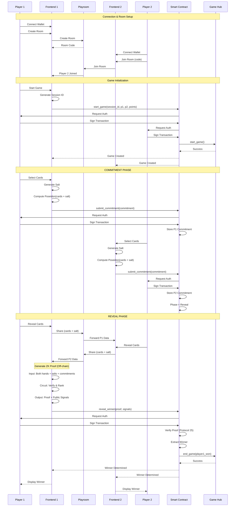
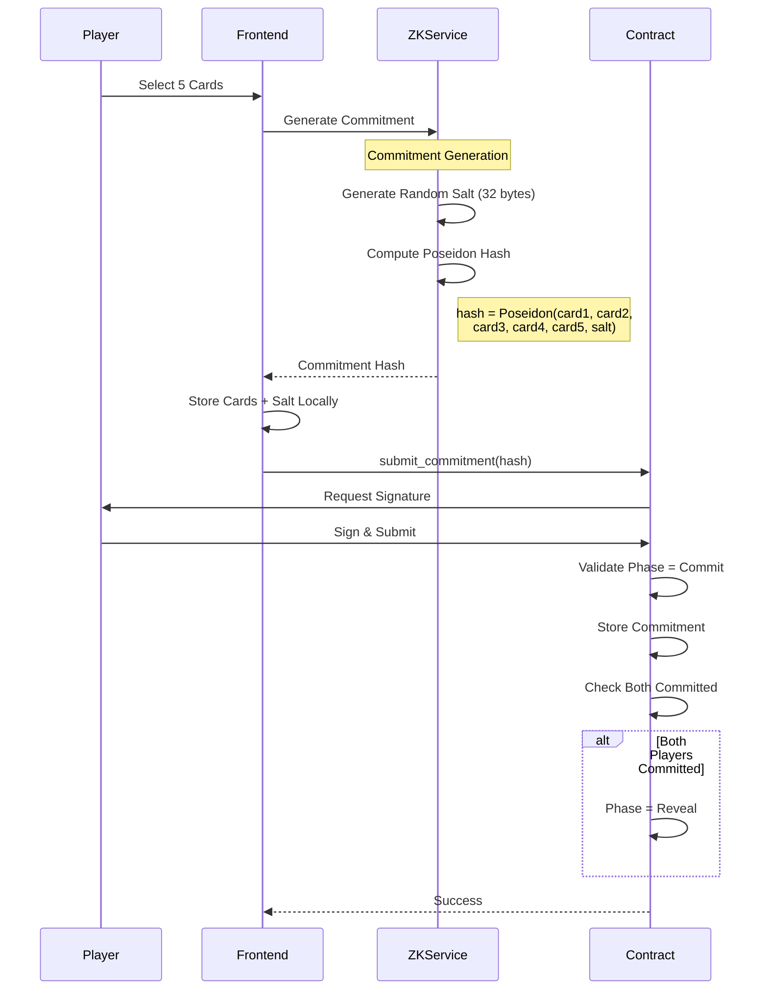
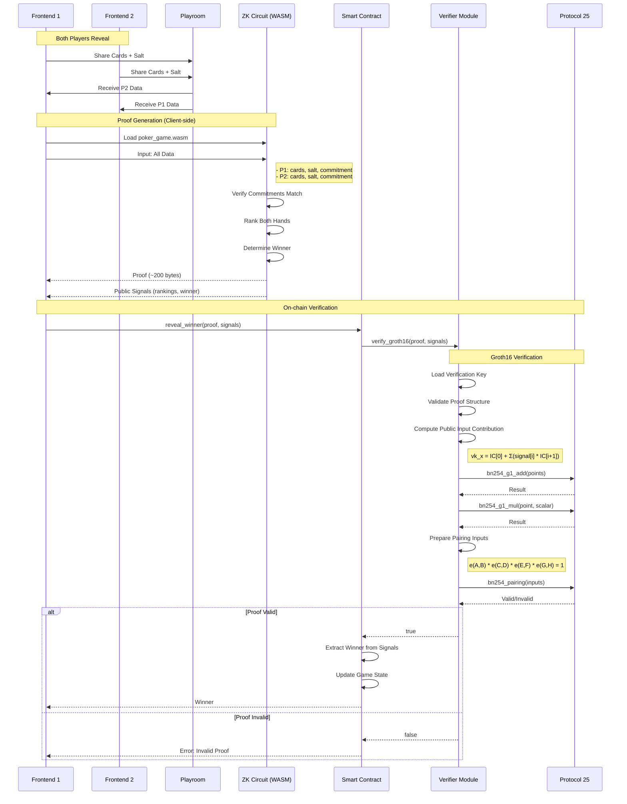
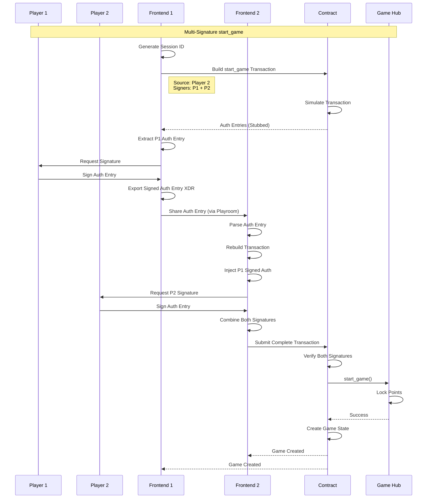

# ZK Poker Architecture

## System Architecture

```
┌─────────────────────────────────────────────────────────────────────────┐
│                         ZK Poker Game System                             │
└─────────────────────────────────────────────────────────────────────────┘

┌─────────────────┐         ┌──────────────────┐         ┌─────────────────┐
│   Frontend      │         │   ZK Circuits    │         │  Soroban        │
│   (React)       │◄───────►│   (Circom)       │◄───────►│  Contract       │
│                 │         │                  │         │  (Rust)         │
│  - Wallet UI    │         │  - Poseidon Hash │         │  - Game State   │
│  - Game Screen  │         │  - Groth16 Proof │         │  - Verification │
│  - ZK Service   │         │  - Hand Ranking  │         │  - Game Hub     │
└─────────────────┘         └──────────────────┘         └─────────────────┘
        │                            │                             │
        │                            │                             │
        ▼                            ▼                             ▼
┌─────────────────┐         ┌──────────────────┐         ┌─────────────────┐
│  Playroom Kit   │         │   SnarkJS        │         │  Protocol 25    │
│  (Multiplayer)  │         │   (Proof Gen)    │         │  (BN254/Poseidon│
└─────────────────┘         └──────────────────┘         └─────────────────┘
```

## Component Breakdown

### 1. Frontend Layer (React + TypeScript)

**Components:**
- `SplashScreen.tsx` - Initial landing page
- `ModeSelectScreen.tsx` - Create/Join room
- `LobbyScreen.tsx` - Waiting room with commitments
- `GameScreen.tsx` - Main game interface
- `Header.tsx` - Navigation and wallet info

**Services:**
- `zkService.ts` - ZK proof generation and commitment
- `pockerService.ts` - Contract interaction
- `devWalletService.ts` - Development wallet management

**State Management:**
- `useWallet.ts` - Wallet connection hook
- `useGameEngine.tsx` - Multiplayer state (Playroom)
- `walletSlice.ts` - Wallet state (Zustand)

### 2. ZK Circuit Layer (Circom)

**Circuits:**
1. `card_commitment.circom` (~5K constraints)
   - Input: cards[5], salt
   - Output: commitment (Poseidon hash)
   - Validates: card range, no duplicates

2. `card_reveal.circom` (~3K constraints)
   - Input: commitment, revealedCards[5], salt
   - Validates: Poseidon(cards + salt) == commitment

3. `hand_ranking.circom` (~20K constraints)
   - Input: cards[5]
   - Output: ranking (0-9), highCard
   - Computes: poker hand strength

4. `poker_game.circom` (~50K constraints)
   - Combines all above circuits
   - Verifies both players' commitments
   - Determines winner
   - Output: rankings, winner (1/2/0)

**Build Artifacts:**
- `poker_game.r1cs` - Constraint system
- `poker_game.wasm` - WASM prover (~2MB)
- `poker_game_final.zkey` - Proving key (~50MB)
- `verification_key.json` - Verification key (~2KB)

### 3. Smart Contract Layer (Soroban/Rust)

**Contract Structure:**
```rust
contracts/pocker/src/
├── lib.rs          # Main contract logic
├── verifier.rs     # Groth16 verifier
└── test.rs         # Unit tests
```

**Key Functions:**
- `start_game()` - Initialize game, call Game Hub
- `submit_commitment()` - Store Poseidon hash
- `reveal_winner()` - Verify proof, determine winner, call end_game
- `get_game()` - Query game state

**Storage:**
- Game state (temporary, 30-day TTL)
- Verification key (instance storage)
- Admin & Game Hub addresses

### 4. Protocol 25 Integration

**Cryptographic Primitives:**
- `Poseidon Hash` - Commitment scheme
- `BN254 Curve` - Elliptic curve for proofs
- `Groth16 Verification` - On-chain proof verification

## Game Flow Sequence Diagrams

### Complete Game Flow



### Commitment Phase Detail



### Proof Generation & Verification



### Multi-Sig Transaction Flow



## Data Flow

### 1. Commitment Phase
```
Player → Generate Hand → Compute Poseidon(cards + salt) → Store on Contract
```

### 2. Proof Generation (Off-chain)
```
Both Hands + Salts + Commitments
    ↓
Circom Circuit (poker_game.circom)
    ↓
SnarkJS Prover (WASM)
    ↓
Groth16 Proof (~200 bytes) + Public Signals
```

### 3. Verification (On-chain)
```
Proof + Public Signals
    ↓
Soroban Contract (verifier.rs)
    ↓
Protocol 25 BN254 Operations
    ↓
Pairing Check: e(A,B) * e(C,D) * e(E,F) * e(G,H) == 1
    ↓
Valid/Invalid → Determine Winner → Call Game Hub
```

## Security Model

### Commitment Binding
- **Property**: Players cannot change cards after commitment
- **Mechanism**: Poseidon hash is cryptographically binding
- **Attack Prevention**: Preimage resistance prevents finding different cards with same hash

### Zero-Knowledge
- **Property**: Private inputs (salts) never revealed on-chain
- **Mechanism**: ZK proof reveals nothing except validity
- **Attack Prevention**: Soundness ensures invalid proofs rejected

### Fairness
- **Property**: Winner determination is verifiable
- **Mechanism**: Hand rankings computed in ZK circuit
- **Attack Prevention**: Completeness ensures valid games always produce valid proofs

## Performance Metrics

| Metric | Value | Notes |
|--------|-------|-------|
| Circuit Constraints | ~50,000 | poker_game.circom |
| Proof Generation Time | 2-5 seconds | Client-side (browser) |
| Proof Size | ~200 bytes | Groth16 |
| Verification Time | <100ms | On-chain (Protocol 25) |
| Proving Key Size | ~50MB | Cached in browser |
| Verification Key Size | ~2KB | Stored in contract |
| WASM Prover Size | ~2MB | Loaded once |

## Deployment Architecture

```
Development:
  - Local Stellar node (stellar-cli)
  - Dev wallets (Freighter)
  - Circuit compilation (local)

Testnet:
  - Stellar Testnet
  - Friendbot funding
  - Contract deployment
  - Frontend (Vercel/Netlify)

Production:
  - Stellar Mainnet
  - Multi-party trusted setup
  - CDN for circuit artifacts
  - Audited contracts
```

## Technology Stack

**Frontend:**
- React 18
- TypeScript
- Vite
- TailwindCSS
- Playroom Kit (multiplayer)
- SnarkJS (proof generation)
- Circomlibjs (Poseidon hash)

**Circuits:**
- Circom 2.1.6
- Circomlib 2.0.5
- SnarkJS 0.7.4
- Groth16 proving system

**Smart Contracts:**
- Soroban SDK
- Rust 1.75+
- Protocol 25 (BN254, Poseidon)

**Infrastructure:**
- Stellar Testnet/Mainnet
- Game Hub contract
- IPFS (circuit artifacts)
- GitHub (source code)

## Future Enhancements

1. **Full Deck Support**
   - 52-card deck with ZK shuffle
   - Texas Hold'em variant
   - Community cards

2. **Multi-Round Games**
   - Betting rounds
   - Folding mechanism
   - Pot management

3. **Optimizations**
   - Reduce constraint count
   - Faster proof generation
   - Smaller proving keys
   - Batch verification

4. **Enhanced Security**
   - Multi-party trusted setup
   - Formal verification
   - Security audit
   - Bug bounty program

## References

- [Circom Documentation](https://docs.circom.io/)
- [SnarkJS Guide](https://github.com/iden3/snarkjs)
- [Stellar Protocol 25](https://stellar.org/protocol-25)
- [Groth16 Paper](https://eprint.iacr.org/2016/260.pdf)
- [Soroban Documentation](https://soroban.stellar.org/)
