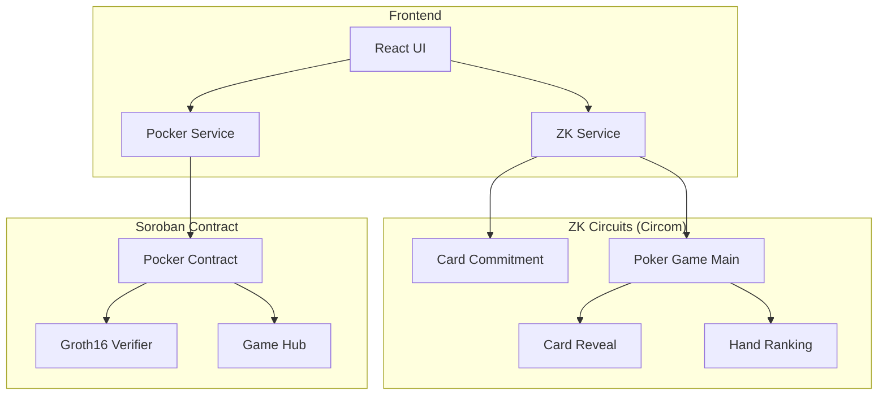
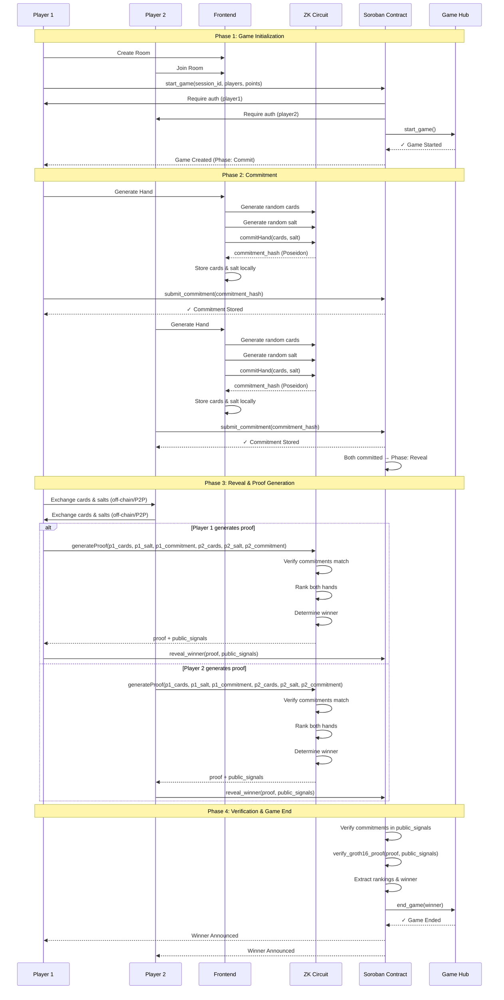
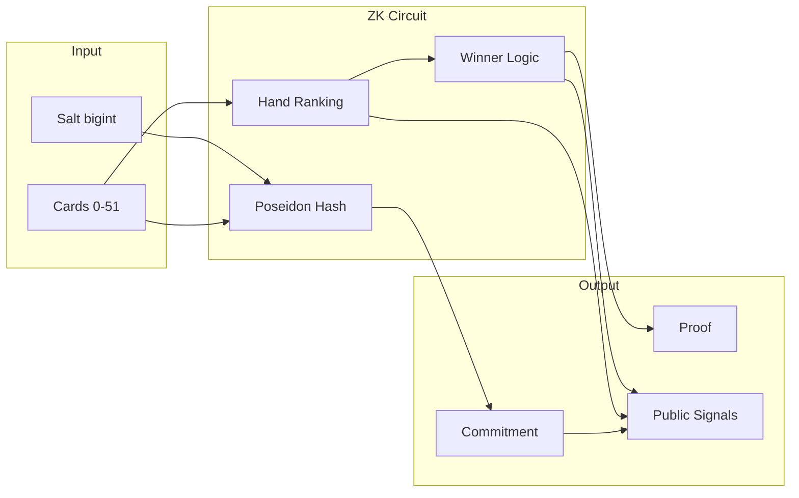

# ZK Poker Integration Guide

Complete production-ready guide for integrating Zero-Knowledge proofs into the Stellar poker game.

## Table of Contents

1. [Architecture Overview](#architecture-overview)
2. [Quick Start](#quick-start)
3. [Circuit Setup](#circuit-setup)
4. [TypeScript Integration](#typescript-integration)
5. [Soroban Contract Integration](#soroban-contract-integration)
6. [Testing](#testing)
7. [Deployment](#deployment)
8. [Security Considerations](#security-considerations)

## Architecture Overview

### System Components



### Game Flow Sequence



### Data Flow



## Quick Start

### Prerequisites

```bash
# Required versions
node >= 18.0.0
circom >= 2.1.6
snarkjs >= 0.7.0
bun >= 1.0.0
stellar-cli >= 21.0.0
rust >= 1.70.0
```

### Installation

```bash
# Clone repository
git clone <your-repo>
cd Stellar-Game-Studio

# Install circuit dependencies
cd circuits/pocker
npm install

# Build circuits (this takes 5-10 minutes)
bash build.sh

# Install frontend dependencies
cd ../../pocker
bun install

# Install contract dependencies
cd ../contracts/pocker
cargo build
```

## Circuit Setup

### 1. Compile Circuits

```bash
cd circuits/pocker

# Compile all circuits
npm run compile:all

# Or compile individually
circom src/card_commitment.circom --r1cs --wasm --sym -o build
circom src/card_reveal.circom --r1cs --wasm --sym -o build
circom src/hand_ranking.circom --r1cs --wasm --sym -o build
circom src/poker_game.circom --r1cs --wasm --sym -o build
```

### 2. Trusted Setup

```bash
# Powers of Tau ceremony (one-time, ~2 minutes)
npm run setup

# This generates:
# - pot14_final.ptau (Powers of Tau file)
# - poker_game_final.zkey (Proving key, ~50MB)
# - verification_key.json (Verification key, ~2KB)
```

### 3. Test Circuits

```bash
# Run circuit tests
npm test

# Generate sample proof
npm run generate-proof
```

### 4. Copy Artifacts to Frontend

```bash
# Copy WASM and proving key
npm run copy-artifacts

# This copies to:
# - pocker/public/circuits/poker_game.wasm
# - pocker/public/circuits/poker_game_final.zkey
```

## TypeScript Integration

### 1. Install Dependencies

```bash
cd pocker
bun add snarkjs circomlibjs
```

### 2. ZK Service Implementation

The `ZKPokerService` class handles all ZK operations:

```typescript
import { ZKPokerService } from './services/zkService';

const zkService = new ZKPokerService();
await zkService.initialize();

// Generate commitment
const cards = [0, 1, 2, 3, 4]; // Your 5 cards
const salt = zkService.generateSalt();
const commitment = await zkService.commitHand(cards, salt);

// Generate proof (after both players committed)
const proofData = await zkService.generateProof(
  player1Cards,
  player1Salt,
  player1Commitment,
  player2Cards,
  player2Salt,
  player2Commitment
);

// Serialize for contract
const serializedProof = zkService.serializeProof(proofData.proof);
```

### 3. Integration with Pocker Service

```typescript
import { PockerService } from './games/pocker/pockerService';

const pockerService = new PockerService(CONTRACT_ID);

// Submit commitment
await pockerService.submitCommitment(
  sessionId,
  playerAddress,
  commitment,
  signer
);

// Reveal winner with proof
await pockerService.revealWinner(
  sessionId,
  serializedProof,
  proofData.publicSignals,
  signer
);
```

### 4. Complete Game Flow Example

```typescript
// Phase 1: Start Game (multi-sig)
const authEntry = await pockerService.prepareStartGame(
  sessionId,
  player1,
  player2,
  player1Points,
  player2Points,
  player1Signer
);

// Player 2 imports and signs
const txXdr = await pockerService.importAndSignAuthEntry(
  authEntry,
  player2,
  player2Points,
  player2Signer
);

// Finalize transaction
await pockerService.finalizeStartGame(txXdr, player2, player2Signer);

// Phase 2: Commit
const cards = zkService.generateRandomHand();
const salt = zkService.generateSalt();
const commitment = await zkService.commitHand(cards, salt);

await pockerService.submitCommitment(
  sessionId,
  playerAddress,
  commitment,
  signer
);

// Phase 3: Reveal (after both committed)
// Exchange cards & salts off-chain (P2P or via signaling server)

const proofData = await zkService.generateProof(
  player1Cards,
  player1Salt,
  player1Commitment,
  player2Cards,
  player2Salt,
  player2Commitment
);

const serializedProof = zkService.serializeProof(proofData.proof);

await pockerService.revealWinner(
  sessionId,
  serializedProof,
  proofData.publicSignals,
  signer
);
```

## Soroban Contract Integration

### 1. Build Contract

```bash
cd contracts/pocker

# Build WASM
stellar contract build --package pocker

# Output: target/wasm32v1-none/release/pocker.wasm
```

### 2. Deploy to Testnet

```bash
# Deploy contract
stellar contract deploy \
  --wasm target/wasm32v1-none/release/pocker.wasm \
  --source <YOUR_SECRET_KEY> \
  --network testnet

# Initialize contract
stellar contract invoke \
  --id <CONTRACT_ID> \
  --source <YOUR_SECRET_KEY> \
  --network testnet \
  -- \
  __constructor \
  --admin <ADMIN_ADDRESS> \
  --game_hub <GAME_HUB_ADDRESS>
```

### 3. Set Verification Key (Optional)

```typescript
// Convert verification key to contract format
const vk = JSON.parse(fs.readFileSync('verification_key.json'));

// Call set_verification_key on contract
await contract.set_verification_key({
  alpha: convertG1Point(vk.vk_alpha_1),
  beta: convertG2Point(vk.vk_beta_2),
  gamma: convertG2Point(vk.vk_gamma_2),
  delta: convertG2Point(vk.vk_delta_2),
  ic: vk.IC.map(convertG1Point)
});
```

### 4. Contract Methods

```rust
// Start game (multi-sig)
pub fn start_game(
    env: Env,
    session_id: u32,
    player1: Address,
    player2: Address,
    player1_points: i128,
    player2_points: i128,
) -> Result<(), Error>

// Submit commitment
pub fn submit_commitment(
    env: Env,
    session_id: u32,
    player: Address,
    commitment: Bytes,
) -> Result<(), Error>

// Reveal winner with ZK proof
pub fn reveal_winner(
    env: Env,
    session_id: u32,
    proof: Groth16Proof,
    public_signals: Vec<Bytes>,
) -> Result<Address, Error>

// Get game state
pub fn get_game(env: Env, session_id: u32) -> Result<Game, Error>
```

## Testing

### 1. Circuit Tests

```bash
cd circuits/pocker
bun test

# Tests cover:
# - Commitment generation
# - Proof generation
# - Proof verification
# - Invalid proof rejection
# - Edge cases
# - Performance benchmarks
```

### 2. Contract Tests

```bash
cd contracts/pocker
cargo test

# Tests cover:
# - Game initialization
# - Start game flow
# - Commitment phase
# - Reveal phase
# - Admin functions
# - Error cases
```

### 3. Integration Tests

```bash
cd pocker
bun test

# End-to-end tests:
# - Full game flow
# - Multi-player scenarios
# - Network error handling
# - Transaction retries
```

## Deployment

### 1. Build Production Artifacts

```bash
# Build circuits
cd circuits/pocker
bash build.sh

# Build contract
cd ../../contracts/pocker
stellar contract build --package pocker

# Build frontend
cd ../../pocker
bun run build
```

### 2. Deploy to Testnet

```bash
# Deploy contract
bun run deploy pocker

# Generate bindings
bun run bindings pocker

# Update contract ID in frontend
# Edit: pocker/public/game-studio-config.js
```

### 3. Deploy Frontend

```bash
# Build for production
cd pocker
bun run build

# Deploy to hosting (Netlify, Vercel, etc.)
netlify deploy --prod
```

## Security Considerations

### 1. Commitment Security

- ✅ Use cryptographically secure random salt (256 bits)
- ✅ Never reuse salts across games
- ✅ Store salts securely (never send to server before reveal)
- ✅ Poseidon hash provides collision resistance

### 2. Proof Security

- ⚠️ Current implementation uses placeholder verifier (accepts all proofs)
- ✅ Production must use Protocol 25 BN254 operations
- ✅ Verification key must match proving key from trusted setup
- ✅ Use multi-party computation (MPC) for production trusted setup

### 3. Contract Security

- ✅ Game Hub integration prevents duplicate start/end events
- ✅ Temporary storage with 30-day TTL
- ✅ Prevent self-play (player1 ≠ player2)
- ✅ Commitment binding (cannot change after submission)
- ✅ Phase validation (commit → reveal → complete)

### 4. Frontend Security

- ✅ Validate all user inputs
- ✅ Handle network errors gracefully
- ✅ Implement transaction retry logic
- ✅ Never expose private keys or salts
- ✅ Use HTTPS for all communications

### 5. Off-Chain Communication

- ⚠️ Card/salt exchange happens off-chain (P2P or signaling server)
- ✅ Use encrypted channels for sensitive data
- ✅ Verify data integrity before proof generation
- ✅ Implement timeout mechanisms

## Performance Optimization

### 1. Proof Generation

- **Client-side**: 2-5 seconds (depends on device)
- **Optimization**: Use Web Workers to avoid blocking UI
- **Caching**: Reuse WASM module across proofs

```typescript
// Use Web Worker for proof generation
const worker = new Worker('/zkWorker.js');
worker.postMessage({ cards, salt, commitment });
worker.onmessage = (e) => {
  const { proof, publicSignals } = e.data;
  // Submit to contract
};
```

### 2. Circuit Size

- **Constraints**: ~50,000 (poker_game.circom)
- **Proving key**: ~50MB
- **Proof size**: ~200 bytes
- **Verification**: <100ms on-chain

### 3. Gas Optimization

- Use temporary storage (cheaper than persistent)
- Batch operations when possible
- Minimize cross-contract calls

## Troubleshooting

### Circuit Compilation Fails

```bash
# Check circom version
circom --version  # Should be 2.1.6+

# Reinstall dependencies
cd circuits/pocker
rm -rf node_modules
npm install

# Check for syntax errors
circom src/poker_game.circom --r1cs --wasm --sym -o build
```

### Proof Generation Fails

```bash
# Verify circuit artifacts exist
ls -la build/poker_game_js/poker_game.wasm
ls -la poker_game_final.zkey

# Check browser console for errors
# Common issues:
# - WASM file not found (check public/circuits/)
# - Out of memory (reduce circuit size or use Web Worker)
# - Invalid inputs (check card values 0-51)
```

### Contract Verification Fails

```bash
# Check Protocol 25 support
stellar contract invoke --help | grep bn254

# Verify proof format matches contract expectations
# - pi_a: 2 elements (G1 point)
# - pi_b: 4 elements (G2 point)
# - pi_c: 2 elements (G1 point)

# Check public signals format
# [0] = player1_commitment
# [1] = player2_commitment
# [2] = player1_ranking
# [3] = player2_ranking
# [4] = winner (1 or 2)
```

## Resources

- [Circom Documentation](https://docs.circom.io/)
- [SnarkJS Guide](https://github.com/iden3/snarkjs)
- [Stellar Protocol 25](https://stellar.org/protocol-25)
- [Groth16 Paper](https://eprint.iacr.org/2016/260.pdf)
- [ZK Poker Theory](https://eprint.iacr.org/2016/1015.pdf)
- [Soroban Documentation](https://soroban.stellar.org/)
- [Game Hub Contract](https://stellar.expert/explorer/testnet/contract/CB4VZAT2UQBNOrnQlzo3ftqm0Jj5Sf9zEHlPApapd-rWsAHREzkweiTw)

## Next Steps

1. ✅ Complete Protocol 25 integration in verifier.rs
2. ✅ Implement production trusted setup (MPC ceremony)
3. ✅ Add deck shuffling for full 52-card games
4. ✅ Optimize circuit constraints
5. ✅ Add comprehensive test suite
6. ✅ Deploy to mainnet
7. ✅ Implement P2P card exchange
8. ✅ Add game replay functionality
9. ✅ Create leaderboard system
10. ✅ Add tournament support
