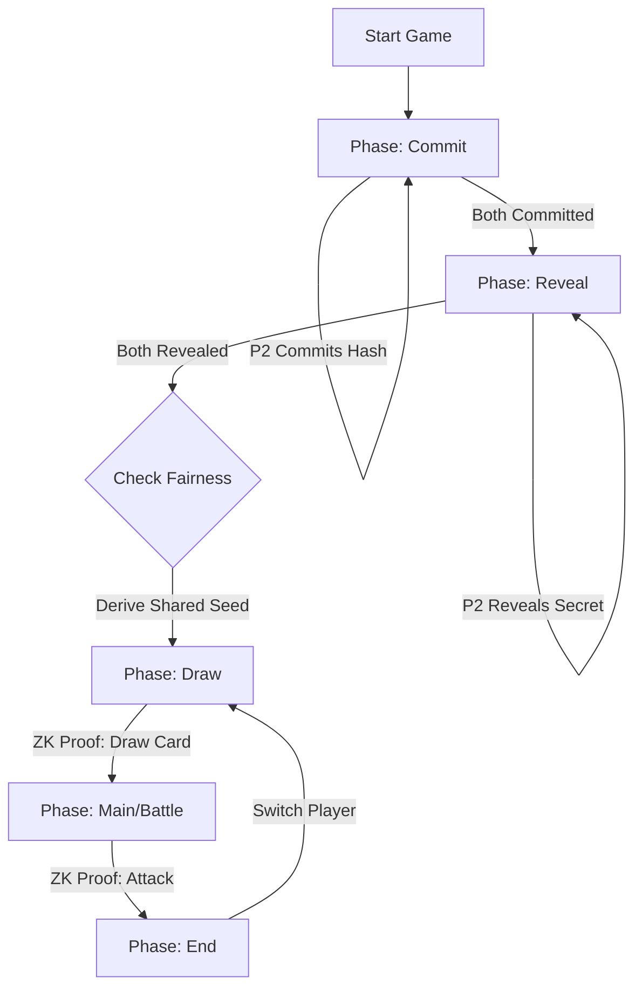

# Etherion (Card RPG) Contract

Robust ZK-based Card Battler on Stellar Soroban.

## Game Flow



## Fairness (Commit-Reveal)

To ensure neither player can predict the RNG:

1.  **Commit**: Both players generate a secret random `seed`. They calculate `Hash(seed)` and submit it to the contract.
    - State: `p1_commit`, `p2_commit`
2.  **Reveal**: Once both commitments are locked, players submit their raw `seed`.
3.  **Verify**: Contract checks `Hash(revealed_seed) == committed_hash`.
4.  **Derive**: Contract computes `SharedSeed = XOR(seed1, seed2)`.
5.  **Use**: `SharedSeed` determines who goes first and seeds the deck shuffling algorithm.

## Zero-Knowledge Logic

- **Deck Shuffle**: The deck permutation is derived from `SharedSeed` off-chain.
- **Draw Proof**: Player proves "I possess card at index I from the deterministic shuffle of (Deck, SharedSeed)".
- **Battle Proof**: Player proves "I am attacking with Card A (ATK X) vs Card B (DEF Y) -> Resulting Damage Z".

## Contract Methods

- `start_game`: Initialize session (8000 LP).
- `commit`: Submit seed hash.
- `reveal`: Submit secret seed.
- `draw_phase`: Submit ZK proof of draw.
- `battle_phase`: Submit ZK proof of battle outcome.
- `end_turn`: Pass turn to opponent.

## Building & Testing

```bash
cargo build --target wasm32-unknown-unknown --release
cargo test
```
