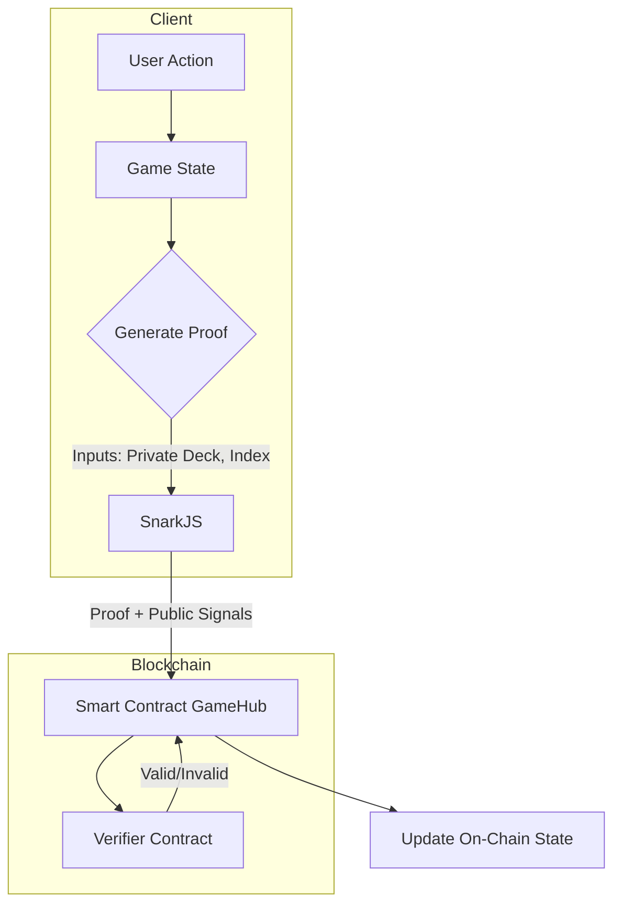
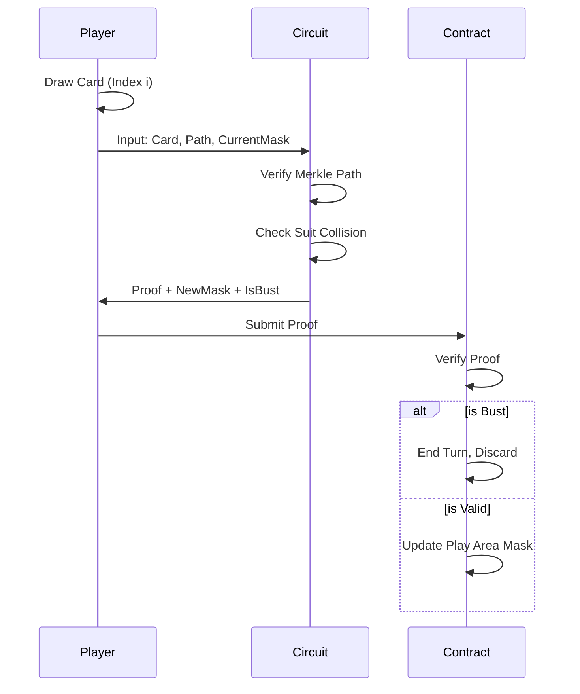

# Zero-Knowledge Architecture

The application relies on `circom` circuits to enforce game logic without revealing private state (deck order, hand contents). This ensures fairness in a peer-to-peer or blockchain setting.

## Architecture Overview

The system is composed of three main layers:

1.  **Frontend (Prover)**: Generates ZK proofs (`.wasm` + `.zkey`) in the browser.
2.  **Smart Contract (Verifier)**: Verifies the proofs on-chain and updates the game state.
3.  **Circuits**: The arithmetic constraints written in Circom.

## Key Circuits

### 1. Deck Commitment (`merkle.circom`)

At the start of the game, players shuffle their decks locally. They do not upload the deck. Instead, they upload the **Merkle Root** of the deck.

- **Merkle Tree**: A binary tree where leaves are hashes of cards (`Hash(CardID + Salt)`).
- **Security**: Ensures players cannot change their cards or their order after the game starts.

### 2. Hand Privacy (`commitment.circom`)

When a card is drawn but not played, it exists in the player's Hand.

- **Pedersen Commitment**: `C = Hash(Card_Value, Blinding_Factor)`
- The public only sees `C`.
- When the card is finally played (Summoned), the player reveals `Card_Value` and `Blinding_Factor`. The contract checks if `Hash(Value, Blinding) == C`.

### 3. Provable Draw Logic (`draw.circom`)

This is the core of the "Dead Man's Draw" mechanic.

**Problem**: How do you prove you drew the top card of your committed deck AND verify if it caused a "Bust" (suit match) without showing the card?

**Solution**:
The `DrawCard` circuit takes:

- **Public**: `DeckRoot`, `CurrentSuitsMask` (Play Area state)
- **Private**: `CardValue`, `MerklePath`

**Circuit Logic**:

1.  **Membership Check**: Verify `MerklePath` leads to `DeckRoot`. Ensures card is actually from the deck.
2.  **Suit Extraction**: Extract the suit bits from `CardValue`.
3.  **Bust Check**: Check if the bit corresponding to the suit is already set in `CurrentSuitsMask`.
4.  **Output**: `IsBust` (0 or 1) and `NewSuitsMask`.

### 4. Atomic Battle (`battle.circom`)

Battles involve comparing ATK/DEF values. In a fully private version (like fog of war), cards might be face-down.

**Circuit Logic**:

- **Inputs**: `MyStat`, `OpponentStat`
- **Constraints**:
  - `Diff = MyStat - OpponentStat`
  - `Winner = 1 if Diff > 0 else 0`
  - `Damage = abs(Diff)`
- **Output**: `Winner`, `Damage`

This allows the contract to act on the result (reduce LP) without necessarily permanently revealing the stats if the monster survives (though in standard rules, combat usually reveals).

## Development Workflow

1.  **Write Circuits**: `circuits/src/*.circom`
2.  **Compile**: `npm run build` (generates `.r1cs` and `.wasm`)
3.  **Setup**: Perform Trusted Setup (Powers of Tau) to generate `.zkey`.
4.  **Generate Solidity**: Export the verifier as a Solidity contract.
5.  **Deploy**: Deploy Game Contract and Verifier.

## Current Implementation Status

| Feature                  | Circuit             | Status         |
| :----------------------- | :------------------ | :------------- |
| **Deck Hashing**         | `merkle.circom`     | ✅ Implemented |
| **Hand Hiding**          | `commitment.circom` | ✅ Implemented |
| **Safety Draw**          | `draw.circom`       | ✅ Implemented |
| **Battle Math**          | `battle.circom`     | ✅ Implemented |
| **Contract Integration** | -                   | 🚧 In Progress |
