# ZK Poker on Stellar

> Provably fair two-player poker using Zero-Knowledge proofs and Stellar Protocol 25

[](https://stellar.org)
[](https://github.com/iden3/snarkjs)
[](LICENSE)

## 🎯 Overview

ZK Poker demonstrates how Zero-Knowledge proofs enable **hidden information gameplay** with **mathematical fairness guarantees** on blockchain. Players commit to their cards privately using Poseidon hashes, play through betting rounds with hidden hands, then prove hand validity at showdown using Groth16 ZK-SNARKs verified on-chain via Stellar's Protocol 25.

**Key Innovation**: No trusted dealer, no server, no cheating possible. Mathematics enforces fairness.

## 🎮 Game Features

- **Texas Hold'em**: 2-player poker with 2 hole cards + 5 community cards
- **Hidden Hands**: Cards committed via Poseidon hash, revealed only at showdown
- **Full Betting**: Fold, Check, Call, Bet, Raise, All-In actions
- **ZK Proofs**: Groth16 proofs verify hand rankings without revealing cards on-chain
- **Protocol 25**: Native BN254 pairing verification for sub-100ms proof checks
- **Multiplayer**: Real-time P2P gameplay via Playroom Kit

## 🏗️ Architecture

```
┌─────────────────────────────────────────────────────────────────┐
│                         ZK Poker System                          │
└─────────────────────────────────────────────────────────────────┘

┌──────────────┐      ┌──────────────┐      ┌──────────────┐
│   Frontend   │◄────►│ ZK Circuits  │◄────►│   Soroban    │
│   (React)    │      │   (Circom)   │      │  Contract    │
│              │      │              │      │              │
│ • Playroom   │      │ • Poseidon   │      │ • Verifier   │
│ • ZK Service │      │ • Groth16    │      │ • Game Hub   │
│ • Wallet UI  │      │ • Hand Rank  │      │ • State      │
└──────────────┘      └──────────────┘      └──────────────┘
       │                     │                      │
       └─────────────────────┴──────────────────────┘
                             │
                    ┌────────▼────────┐
                    │   Protocol 25   │
                    │  BN254 Pairing  │
                    └─────────────────┘
```

## 🔐 Zero-Knowledge Flow

```mermaid
sequenceDiagram
    autonumber
    participant P1 as Player 1
    participant P2 as Player 2
    participant FE as Frontend
    participant ZK as ZK Circuit
    participant SC as Smart Contract
    participant P25 as Protocol 25

    Note over P1,P25: PHASE 1: COMMITMENT (Hidden Information)
    
    P1->>FE: Select 2 Hole Cards
    FE->>FE: Generate Random Salt
    FE->>ZK: Poseidon(cards + salt)
    ZK-->>FE: commitment_hash
    FE->>SC: submit_hole_commitment(hash)
    SC->>SC: Store P1 commitment ✓
    
    P2->>FE: Select 2 Hole Cards
    FE->>FE: Generate Random Salt
    FE->>ZK: Poseidon(cards + salt)
    ZK-->>FE: commitment_hash
    FE->>SC: submit_hole_commitment(hash)
    SC->>SC: Store P2 commitment ✓
    SC->>SC: Generate 5 community cards
    SC->>SC: Phase → Preflop
    
    Note over P1,P25: PHASE 2: BETTING ROUNDS (Cards Hidden)
    
    P1->>SC: player_action(Bet 100)
    P2->>SC: player_action(Call 100)
    SC->>SC: Phase → Flop (reveal 3 cards)
    
    P1->>SC: player_action(Check)
    P2->>SC: player_action(Bet 200)
    P1->>SC: player_action(Call 200)
    SC->>SC: Phase → Turn (reveal 4th card)
    
    P1->>SC: player_action(Check)
    P2->>SC: player_action(Check)
    SC->>SC: Phase → River (reveal 5th card)
    
    P1->>SC: player_action(Bet 300)
    P2->>SC: player_action(Call 300)
    SC->>SC: Phase → Showdown
    
    Note over P1,P25: PHASE 3: SHOWDOWN (ZK Proof)
    
    P1->>P2: Exchange cards + salts (P2P)
    P2->>P1: Exchange cards + salts (P2P)
    
    FE->>ZK: generateProof(all_data)
    
    Note over ZK: Verify Commitments<br/>Rank Hands<br/>Determine Winner
    
    ZK-->>FE: proof + public_signals
    
    FE->>SC: reveal_winner(proof, signals)
    
    Note over P1,P25: PHASE 4: VERIFICATION (Protocol 25)
    
    SC->>SC: Verify commitments match
    SC->>P25: verify_groth16(proof)
    
    Note over P25: BN254 Pairing Check<br/>e(A,B)*e(C,D)*e(E,F)*e(G,H)=1
    
    P25-->>SC: VALID ✓
    SC->>SC: Extract winner from signals
    SC->>SC: Call GameHub.end_game()
    SC-->>FE: Winner announced 🎉
```



## 🚀 Quick Start

### Prerequisites

```bash
node >= 18.0.0
bun >= 1.0.0
stellar-cli >= 21.0.0
```

### Installation

```bash
# Clone repository
git clone <repo-url>
cd Stellar-Game-Studio/pocker

# Install dependencies
bun install

# Start development server
bun run dev
```

### Play the Game

1. **Connect Wallet**: Use Freighter or dev wallet
2. **Create Room**: Generate a room code
3. **Share Code**: Send to opponent
4. **Start Game**: Both players sign multi-sig transaction
5. **Commit Cards**: Select 2 hole cards (hidden)
6. **Play Rounds**: Bet through Preflop → Flop → Turn → River
7. **Showdown**: Generate ZK proof and reveal winner

## 🔬 ZK Circuits

### Circuit Architecture

```
circuits/pocker/src/
├── card_commitment.circom    (~5K constraints)
│   └── Poseidon hash commitment for cards
├── card_reveal.circom        (~3K constraints)
│   └── Prove revealed cards match commitment
├── hand_ranking.circom       (~20K constraints)
│   └── Compute poker hand ranking (0-9)
└── poker_game.circom         (~50K constraints)
    └── Master circuit: verify + rank + determine winner
```

### Commitment Circuit

```circom
// Input (Private)
signal input cards[2];      // [0-51] representing deck
signal input salt;          // Random 256-bit number

// Output (Public)
signal output commitment;   // Poseidon hash

// Constraints
- cards[i] in range [0, 51]
- cards[0] ≠ cards[1]
- commitment = Poseidon(cards[0], cards[1], salt)
```

### Poker Game Circuit

```circom
// Inputs (Private)
signal input player1_cards[2];
signal input player1_salt;
signal input player2_cards[2];
signal input player2_salt;
signal input community_cards[5];
signal input community_salt;

// Inputs (Public)
signal input player1_commitment;
signal input player2_commitment;
signal input community_commitment;

// Outputs (Public)
signal output player1_ranking;  // 0-9 (High Card → Royal Flush)
signal output player2_ranking;  // 0-9
signal output winner;           // 1 = P1, 2 = P2, 0 = tie

// Verification Steps
1. Verify P1 commitment: Poseidon(P1_cards, P1_salt) == P1_commitment
2. Verify P2 commitment: Poseidon(P2_cards, P2_salt) == P2_commitment
3. Verify community commitment: Poseidon(community, salt) == commitment
4. Rank P1 hand (2 hole + 5 community → best 5)
5. Rank P2 hand (2 hole + 5 community → best 5)
6. Determine winner (higher ranking wins)
```

### Build Circuits

```bash
cd circuits/pocker

# Compile circuits
npm run compile:all

# Trusted setup (generates proving/verification keys)
npm run setup

# Copy artifacts to frontend
npm run copy-artifacts
```

## 📜 Smart Contract

### Contract Interface

```rust
// Initialize contract
pub fn __constructor(env: Env, admin: Address, game_hub: Address)

// Start game (multi-sig)
pub fn start_game(
    env: Env,
    session_id: u32,
    player1: Address,
    player2: Address,
    player1_points: i128,
    player2_points: i128,
) -> Result<(), Error>

// Commit to 2 hole cards
pub fn submit_hole_commitment(
    env: Env,
    session_id: u32,
    player: Address,
    hole_commitment: Bytes,
) -> Result<(), Error>

// Execute betting action
pub fn player_action(
    env: Env,
    session_id: u32,
    player: Address,
    action: Action,  // Fold, Check, Call, Bet, Raise, AllIn
) -> Result<(), Error>

// Reveal winner with ZK proof
pub fn reveal_winner(
    env: Env,
    session_id: u32,
    proof: Groth16Proof,
    public_signals: Vec<Bytes>,
) -> Result<Address, Error>

// Query game state
pub fn get_game(env: Env, session_id: u32) -> Result<Game, Error>
```

### Game State Machine

```
Commit → Preflop → Flop → Turn → River → Showdown → Complete
  ↓         ↓        ↓      ↓      ↓        ↓          ↓
 Cards    Bet 1   Bet 2  Bet 3  Bet 4   ZK Proof   Winner
Hidden   (2 hole) (+3)   (+1)   (+1)    Verify    Payout
```

### Protocol 25 Verification

```rust
// BN254 Groth16 Verification
pub fn verify_groth16(
    env: &Env,
    proof: Groth16Proof,
    public_signals: Vec<Bytes>,
) -> Result<(), Error> {
    // 1. Load verification key
    let vk = load_verification_key(env);
    
    // 2. Compute public input contribution
    // vk_x = IC[0] + Σ(signal[i] * IC[i+1])
    let vk_x = compute_public_input(vk, public_signals);
    
    // 3. Prepare pairing inputs
    let pairing_inputs = [
        (proof.pi_a, vk.alpha),
        (vk.beta, proof.pi_b),
        (vk_x, vk.gamma),
        (proof.pi_c, vk.delta),
    ];
    
    // 4. Execute pairing check (Protocol 25)
    // e(A,B) * e(C,D) * e(E,F) * e(G,H) = 1
    let result = env.crypto().bn254_pairing(pairing_inputs);
    
    if !result {
        return Err(Error::InvalidProof);
    }
    
    Ok(())
}
```

## 🎨 Frontend Integration

### ZK Service

```typescript
import { ZKPokerService } from './services/zkService';

const zkService = new ZKPokerService();
await zkService.initialize();

// Generate commitment
const cards = [0, 51]; // A♠, K♠
const salt = zkService.generateSalt();
const commitment = await zkService.commitHand(cards, salt);

// Generate proof at showdown
const proofData = await zkService.generateProof(
  player1Cards,
  player1Salt,
  player1Commitment,
  player2Cards,
  player2Salt,
  player2Commitment,
  communityCards,
  communitySalt,
  communityCommitment
);

// Serialize for contract
const serializedProof = zkService.serializeProof(proofData.proof);
```

### Pocker Service

```typescript
import { PockerService } from './games/pocker/pockerService';

const pockerService = new PockerService(CONTRACT_ID);

// Start game (multi-sig flow)
const authEntry = await pockerService.prepareStartGame(
  sessionId, player1, player2, points1, points2, signer1
);
// Player 2 imports and signs
const txXdr = await pockerService.importAndSignAuthEntry(
  authEntry, player2, points2, signer2
);
// Finalize
await pockerService.finalizeStartGame(txXdr, player2, signer2);

// Submit commitment
await pockerService.submitHoleCommitment(
  sessionId, playerAddress, commitment, signer
);

// Execute action
await pockerService.playerAction(
  sessionId, playerAddress, { tag: 'Bet', values: [100n] }, signer
);

// Reveal winner
await pockerService.revealWinner(
  sessionId, playerAddress, proof, publicSignals, signer
);
```

## 📊 Performance Metrics

| Metric | Value | Notes |
|--------|-------|-------|
| Circuit Constraints | ~50,000 | poker_game.circom |
| Proof Generation | 2-5 seconds | Client-side (browser) |
| Proof Size | ~200 bytes | Groth16 |
| Verification Time | <100ms | On-chain (Protocol 25) |
| Proving Key | ~50MB | Cached in browser |
| Verification Key | ~2KB | Stored in contract |
| WASM Prover | ~2MB | Loaded once |

## 🔒 Security Properties

### Commitment Binding
- **Property**: Players cannot change cards after commitment
- **Mechanism**: Poseidon hash preimage resistance
- **Attack Prevention**: Finding different cards with same hash is computationally infeasible

### Zero-Knowledge
- **Property**: Private inputs (salts, cards) never revealed on-chain
- **Mechanism**: ZK proof reveals nothing except validity
- **Attack Prevention**: Soundness ensures invalid proofs rejected

### Fairness
- **Property**: Winner determination is verifiable
- **Mechanism**: Hand rankings computed in ZK circuit
- **Attack Prevention**: Completeness ensures valid games always produce valid proofs

### Deterministic Randomness
- **Property**: Community cards unpredictable but verifiable
- **Mechanism**: PRNG seeded with player commitments
- **Attack Prevention**: Neither player can predict or manipulate cards

## 🛠️ Development

### Build Contract

```bash
cd contracts/pocker
stellar contract build --package pocker
```

### Deploy to Testnet

```bash
# Deploy contract
stellar contract deploy \
  --wasm target/wasm32-unknown-unknown/release/pocker.wasm \
  --source <SECRET_KEY> \
  --network testnet

# Initialize
stellar contract invoke \
  --id <CONTRACT_ID> \
  --source <SECRET_KEY> \
  --network testnet \
  -- \
  __constructor \
  --admin <ADMIN_ADDRESS> \
  --game_hub CB4VZAT2UQBNOrnQlzo3ftqm0Jj5Sf9zEHlPApapd-rWsAHREzkweiTw
```

### Generate Bindings

```bash
cd ../..
bun run bindings pocker
```

### Run Tests

```bash
# Circuit tests
cd circuits/pocker
npm test

# Contract tests
cd ../../contracts/pocker
cargo test

# Frontend tests
cd ../../pocker
bun test
```

## 📚 Technical Resources

- **Circom Documentation**: https://docs.circom.io/
- **SnarkJS Guide**: https://github.com/iden3/snarkjs
- **Stellar Protocol 25**: https://stellar.org/protocol-25
- **Groth16 Paper**: https://eprint.iacr.org/2016/260.pdf
- **Soroban Docs**: https://soroban.stellar.org/

## 🎯 Use Cases

1. **Fair Online Poker**: Eliminate house edge and trust requirements
2. **Tournament Gaming**: Provably fair competitions with verifiable results
3. **Educational Tool**: Demonstrate ZK cryptography in accessible way
4. **Web3 Gaming Standard**: Blueprint for other card/board games

## 🚧 Future Enhancements

- [ ] Full 52-card deck with ZK shuffle
- [ ] Multi-round tournaments
- [ ] Spectator mode with delayed reveals
- [ ] Mobile app (React Native)
- [ ] Leaderboard and statistics
- [ ] Multi-table support

## 📄 License

MIT License - see [LICENSE](../LICENSE) for details

## 🤝 Contributing

Contributions welcome! Please read [CONTRIBUTING.md](../CONTRIBUTING.md) first.

## 🙏 Acknowledgments

- Stellar Development Foundation for Protocol 25
- iden3 team for Circom and SnarkJS
- Hermez for Powers of Tau ceremony
- Stellar Game Studio framework

---

**Built for DoraHacks ZK Gaming Hackathon | Powered by Stellar Protocol 25 | Secured by Zero-Knowledge Proofs**
